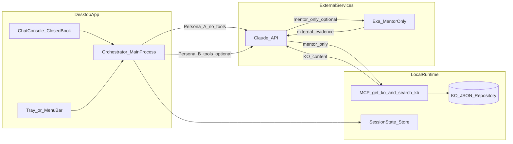
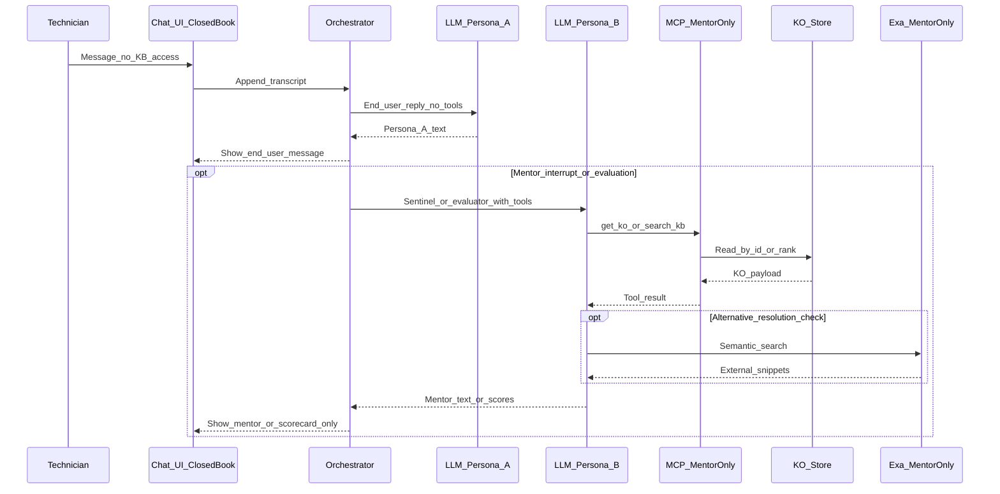
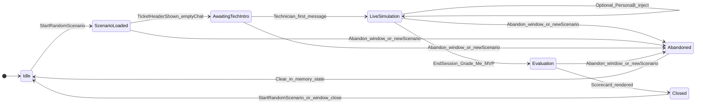

# IT Technician Training Simulator — Project Architecture & Plan

**Document purpose:** Technical blueprint, guardrails, and phased delivery plan for an AI-driven IT technician training demo. This is planning documentation only — no implementation instructions, commands, or application code.

**Audience:** Small internal team (Help Desk / IT operations background) building with AI-assisted tooling.

---

## Executive architecture summary

This product is a **cross-platform desktop application** that gives technicians a **native-feeling** practice environment: a **chat console** for simulated incidents, a **menu bar (macOS) / system tray (Windows)** presence, and a **dual-persona AI layer** — a **simulated end-user** plus a **background mentor/grader** — so practice mirrors real Help Desk rhythm and coaching.

A **second assessment mode** — **Written ATS Drill** — adds a timed, closed-book **written** workflow with **deterministic rubric-keyword** scoring (**no LLM** on that grading path). It is **additive**, reuses the same desktop shell and KO corpus, and ships **after** the Chat Practice MVP (see [Written ATS Drill (additive assessment mode)](#written-ats-drill-additive-assessment-mode)). It does **not** remove MCP, dual personas, or the chat evaluator.

The architecture rests on **three pillars** for **Chat Practice**, with **two cross-cutting design requirements** woven through interface, state, and prompts:

1. **The Interface** — Desktop shell with tray/menubar integration and a **closed-book** chat UI for “technical case” simulations: **mock ticket header**, **Start Random Scenario**, visually distinct **End-User** vs **Mentor** messages, technician-first conversation opening, and **no** runbook/web search for the technician during the attempt (see [Session initiation and persona flow](#session-initiation-and-persona-flow) and [Closed-book assessment and mentor-only knowledge](#closed-book-assessment-and-mentor-only-knowledge)).
2. **The Brain (MCP server)** — A **local** service using the **Model Context Protocol (MCP)** to expose **mentor-only** tools — at minimum loading the **bound KO by id** (e.g. `get_ko(ko_number)`) and optionally **`search_kb(query)`** for cross-KO checks — so **Persona B** (and the orchestrator on its behalf) can read KOs **without** the technician seeing them (see [Closed-book assessment and mentor-only knowledge](#closed-book-assessment-and-mentor-only-knowledge)).
3. **The Intelligence** — A capable frontier-class model (e.g. **Claude 3.5 Sonnet** *(example only — version pinned per release by prompt engineer; not a hard requirement)* or equivalent) orchestrating **Persona A (simulated end-user)** and **Persona B (AI mentor/grader)** (see [Dual persona architecture](#dual-persona-architecture-the-chat-experience)), consuming tool results, and producing **structured evaluation** against the **ATS three-factor rubric** (see [ATS assessment matrix](#ats-assessment-matrix-simulator-rubric)).

**Cross-cutting requirements:**

- **Dual persona architecture** — One session, two AI roles: the **non-technical end-user** (default voice in chat) and the **senior mentor** (sparse in-chat interventions + final evaluation).
- **Session initiation and persona flow** — Random KO-driven scenario, **ticket header**, **empty chat** until the **technician** speaks first, scripted opening behavior for the end-user, and **FMNO** handling (see same-named section).
- **Closed-book assessment** — During a graded simulation the **technician has no UI access** to internal KOs or Exa; **MCP** (and **Exa** when enabled post-MVP) are **backend-only** for **Persona B / orchestrator** — **MVP:** tool calls are **`get_ko` / `search_kb` only**; **Exa** is **not** on the MVP scoring path (see [Closed-book assessment and mentor-only knowledge](#closed-book-assessment-and-mentor-only-knowledge)).

**Knowledge strategy (three layers, assessment mode):**

- **Internal:** A local **mock ServiceNow** corpus — JSON KOs (**40** total for Phase 1: **10** each Mac, Windows, Zoom, Office Apps — see [KO generation strategy](#ko-generation-strategy--phase-1-corpus-40-mock-records)). Each **Start Random Scenario** run **binds one KO** as the primary **answer key** for grading.
- **External (Exa.ai):** **Not** used to “discover” the scenario (the scenario is already defined by the bound KO). **MVP:** Exa is **not** required for scoring — grading uses **bound KO + transcript** only. **Post-MVP:** Exa on mentor paths for **alternative-resolution adjudication**, supplementary context, and **post-session debrief** (see [Knowledge and external validation policy](#knowledge-and-external-validation-policy-mcp-exa-scoring)).
- **Validation / synthesis (MVP):** Persona B **synthesizes** **bound KO ground truth** + transcript for scoring using the **ATS rubric** (see [ATS assessment matrix](#ats-assessment-matrix-simulator-rubric) and [Evaluation guardrails and AI mentor persona](#evaluation-guardrails-and-ai-mentor-persona)). **Post-MVP:** optional Exa snippets for tier-2 adjudication.

**Default technical bet:** **Electron + TypeScript + React** for the desktop app and a **Node/TypeScript MCP server** in the same repo, optimized for **velocity and AI-assisted development** over minimal binary size.

---

## Closed-book assessment and mentor-only knowledge

This simulator is an **assessment**: it should test **memory, probing, structure, and judgment** *(mapped to ATS factors: Technical Knowledge, Logical and Critical Thinking, Root Cause and Integral Troubleshooting)* — like a **closed-book** exercise — not **lookup speed** during the attempt.

### What the technician must not see during the simulation

- **No “Search KB” button**, no **internal KO browser**, and no **runbook/evidence panel** fed from MCP while the session is **live** or until the technician explicitly **ends** the graded attempt.
- **No Exa** in the technician UI during the simulation.

### Who may call MCP and Exa

- **Persona A (end-user):** **No** MCP tools and **no** Exa — already required so the customer does not quote runbooks.
- **Persona B (mentor sentinel + evaluator)** and the **app orchestrator** (acting for Persona B): **may** call **MCP** on **server-side / privileged** code paths for **MVP** grading (**`get_ko`**, optional **`search_kb`**). **Exa** on those paths is **post-MVP** for adjudication and debrief (see [Knowledge and external validation policy](#knowledge-and-external-validation-policy-mcp-exa-scoring)). Results are logged to the **evidence trail** — **never** exposed as a searchable library to the technician **during** the attempt.

### Primary mentor retrieval pattern

- Because each session **binds one KO**, the default ground-truth load is **`get_ko(bound_ko_number)`** (or equivalent read-by-id). This is simpler and more reliable than semantic search for “which article is the answer key.”
- Optional **`search_kb(query)`** remains useful for **Persona B** to check whether the technician **chased the wrong article** or to compare wording — **mentor-only**, not technician-facing.

### Mentor “peek” discipline

- Loading the **full KO** on every turn can **over-coach** sentinel behavior. Prefer: **full KO text** loaded heavily for **evaluation**, and **selectively** for sentinel (e.g. after **stuck** / **nuclear** triggers) (MVP: stuck = technician clicks **I’m stuck** button; nuclear = destructive action keyword — automated loop detection is post-MVP), unless prompts prove stable without excessive hint leakage.
- **Recommended default (MVP):** Sentinel path uses **no** full KO load on every turn — inject **`get_ko` excerpts** or a **short scenario summary** from orchestrator memory **only** when the technician clicks **“I’m stuck — mentor hint”** or when **nuclear/disproportionate** remediation is detected (see [Dual persona architecture](#dual-persona-architecture-the-chat-experience)). Evaluator path always attempts **full `get_ko`** for ground truth unless the call fails (see [Session state management design](#session-state-management-design)).

---

## Knowledge and external validation policy (MCP, Exa, scoring)

### Why Exa still matters when scenarios are KO-bound

The bound KO is the **primary** grading reference, but technicians may propose a **valid fix** that is **not** documented in that KO. **Exa** lets the **observer (Persona B)** gather **external** vendor or reputable documentation to judge whether an **alternative path** is **plausible and applicable** — reducing **unfair false negatives**.

### Rubric tiers (document in evaluator prompt / product spec)

1. **KO-aligned resolution** — Strong credit when the technician’s logic and steps match the bound KO’s intended root cause and remediation (as reflected in `ts_steps` / `internal_information`).
2. **Equivalent alternative (Exa-supported)** — Credit when the path **diverges** from the KO but **Exa-backed evidence + sound reasoning** show the approach is **applicable** to the **stated symptoms and environment**, and **not** contradicted by **safety** or **org policy** flags in the KO.
3. **Unsupported or risky** — Lower or no credit when external evidence does **not** support the claim, or when the approach conflicts with explicit **do-not** / escalation guidance in the KO or known policy.

**Default anchor:** The **bound KO** remains **canonical** for **what the organization documented**; Exa **adjudicates equivalence and freshness**, not automatic override of safety-critical KO guidance.

### MVP vs post-MVP (rubric tiers and Exa)

- **MVP — automated score math:** Apply **tier 1 (KO-aligned)** logic only — the evaluator grades against the **bound KO** and transcript using the **ATS three-factor rubric**. **No Exa calls** are required for scoring in v1.
- **Post-MVP:** **Exa integration enables tier 2 adjudication only.** **Tier 3** (unsupported/risky resolution paths) is an **evaluator scoring judgment** applied to the technician’s **resolution narrative** — it is **separate** from the **nuclear sentinel**, which detects **destructive action proposals** mid-simulation via **keyword/small-model pass** and does **not** require Exa. **Do not** call Exa for tier 3 detection. Enable tier 2 so technicians are not unfairly penalized for **valid paths not written in the KO** (see tier definitions above).

### Exa use cases (all mentor-side or post-session unless noted)

| Use case | When | Technician sees it during sim? |
|----------|------|----------------------------------|
| **Alternative resolution adjudication** | Post-MVP evaluation (and optionally sentinel if policy allows). Not on MVP scoring path — KO + transcript only in v1. | **No** — only outcomes in scores/feedback |
| **Supplementary mentor context** | Optional, for richer coaching narrative | **No** during sim |
| **Post-session debrief** | After final scores *(post-MVP only — deferred per MVP scope; not wired in MVP build)* | **Yes** — optional “Explore external references” for **learning** (does not change that attempt’s grade) |
| **KO authoring / maintenance** | Offline, building the Phase 1 corpus (**40** KOs) | N/A (not runtime assessment) |

### Exa guardrails

- Treat Exa hits as **noisy evidence** — irrelevant pages, outdated blogs, wrong product version. Persona B must **weigh** results, not treat top hit as truth.
- **Safety and policy:** Do not let a random web snippet **override** explicit KO warnings, org standards, or destructive-approval rules without a **defined** escalation policy.
- **Transparency:** Written feedback may **briefly** cite that an alternative was “consistent with public vendor guidance on X” without dumping full URLs during the sim; **post-session** UI may show links if desired.

### Evidence trail (closed-book compatible)

- **MVP:** Log **MCP** (`get_ko`, optional `search_kb`) as **EvidenceEvents** with tool name, args, timestamp, and raw/summarized results — **auditable** for fairness reviews and prompt tuning, **not** technician-facing during the attempt.
- **Post-MVP:** Add **Exa** events when alternative-path adjudication is enabled — same audit rules.

---

## Recommended system architecture

### High-level flow

- The **renderer** (chat UI) collects technician input, renders the **ticket header**, and displays messages tagged by **author role** (technician, simulated end-user, mentor) so personas never blur visually.
- The **main process** (or a small local coordinator) holds **session state** — including **scenario binding** (selected KO), **intro phase** (technician must speak first), **FMNO** value once generated, and **persona routing** — and orchestrates calls to the **LLM API**.
- **Normal turns:** The app requests a reply **as Persona A (end-user)** only, with strict persona guardrails (see [Dual persona architecture](#dual-persona-architecture-the-chat-experience)). **Closed-book:** Persona A has **no tools**. **MCP** and **Exa** are **not** available to the technician in the UI during the graded attempt (see [Closed-book assessment and mentor-only knowledge](#closed-book-assessment-and-mentor-only-knowledge)).
- **Mentor / orchestrator (background):** When Persona B runs (sentinel or evaluation), the orchestrator may attach **tool use** — typically **`get_ko(bound_ko_number)`** first, then optional **`search_kb`**. **Exa** is **post-MVP** on these paths per [Knowledge and external validation policy](#knowledge-and-external-validation-policy-mcp-exa-scoring). Tool outputs are **never** rendered as a technician-facing KB browser mid-sim.
- **Mentor interrupts (Persona B) — implementation order:** **MVP (priority 1):** The technician uses an explicit **“I’m stuck — mentor hint”** control; that action triggers a **sentinel** pass (Persona B in-thread coaching). **Post-MVP (priority 2):** Add **automated** stuck detection (e.g. loop / no-progress heuristics or a small classifier on recent turns) so hints can fire without the button — tune thresholds in prompts and QA.
- **Destructive / “nuclear” course-correction (MVP):** Still use a **lightweight check** on outgoing **technician** text (keyword/heuristic or small model pass — build-time choice) to inject a **sentinel** message when the technician proposes **disproportionate** remediation (reimage, wipe, full OS reinstall, etc.). This is **separate** from stuck detection; it does **not** replace the **“I’m stuck”** button for general confusion. **MVP allowlist/denylist owner:** A **single named owner per release** (the prompt engineer assigned to **Phase 2**) maintains and **QA-validates** the nuclear keyword list. **No** code change to nuclear detection ships without sign-off from that named owner. **Canonical nuclear gate** (when the check runs, gibberish exclusion, ordering vs stuck): [Runtime behavioral rules and edge cases](#8-runtime-behavioral-rules-and-edge-cases). Product voice / keyword policy: [Dual persona architecture](#dual-persona-architecture-the-chat-experience) — **Persona B**, **MVP — nuclear / disproportionate**.
- **End of session (MVP):** Evaluation starts **only** when the technician clicks **“End Session / Grade Me”** (wording may vary). **No** automatic “ticket resolved” transition in v1. **Post-MVP enhancement:** optional auto-resolve when the model and product rules confidently detect resolution (see [Session lifecycle overview](#session-lifecycle-overview-dual-persona)).
- **End of session — evaluator:** A defined **evaluation phase** runs **Persona B** as **evaluator only**: **scored canonical** transcript ([Export Rules](#5-export-rules)) + evidence trail + rubric → scores and coaching (with **degraded** behavior if `get_ko` fails — see [Session state management design](#session-state-management-design)).

### System architecture diagram



**Diagram notes:** The **technician UI** does **not** connect directly to **MCP** or **Exa**; only the **orchestrator** + **Persona B** paths invoke tools and external search. **MVP:** The **Exa** edge is **not wired** for scoring or adjudication — treat it as **post-MVP** in implementation even though the long-term architecture diagram shows the capability.


### Simulation turn sequence (conceptual)



### Session lifecycle overview (dual persona)



**Diagram note (MVP vs post-MVP):** **`EndSession_Grade_Me_MVP`** means **explicit** technician action only. **Post-MVP:** an additional transition (e.g. **AutoResolved_confidence**) may move **`LiveSimulation` → `Evaluation`** when product rules allow — **not** in v1.

### Abandon and reset behavior

- **Abandon** occurs when the technician **closes the application window** (or quits the sim without completing evaluation) **or** clicks **Start Random Scenario** while a session is already **in progress** (`ScenarioLoaded`, `AwaitingTechIntro`, `LiveSimulation`, or `Evaluation`).
- **From `Closed` (scorecard visible):** Starting a new scenario **or** closing the application window from **Closed** follows the **same clear-session behavior** as abandon — the session is **discarded** and state returns to **Idle** / `phase: null`. The state diagram shows **`Closed → Idle`** for that path. There is **no** direct **Closed → Abandoned** transition.
- On abandon: the current session is **discarded** — **in-memory state is cleared** (transcript, `fmnoValue`, bound KO binding, evidence events for that run). **No** final score is persisted for that attempt; the run is **not graded** as Pass/Needs Improvement.
- After reset, the app is in **`Idle`** until the user starts a new scenario. A new **Start Random Scenario** then selects a (possibly new) KO and fresh header values as usual.
- **Product copy:** Treat abandoned runs as **unsaved / discarded**, distinct from **Needs Improvement** on a completed evaluation.
- **Abandon during evaluation:** If the technician abandons while Persona B is running the evaluation pass (`phase: evaluation`), the in-flight grading is **canceled**. **No** scorecard is saved or shown. The session is discarded **identically** to a mid-simulation abandon.
- **Teardown failure:** If session teardown fails (e.g. async clear throws), **log** the error and force **`phase: null`** regardless — do **not** leave **`phase: abandoned`** as a persistent state. **No** recovery path is defined for MVP; silent loss is accepted and logged.
- **Unified teardown (`phase: abandoned`):** Any path that sets `phase: abandoned` (user-initiated abandon, evaluator API failure, evaluator parse failure, evaluation timeout) must **immediately** run the same teardown sequence **without** rendering `abandoned` as a persistent screen state: **(1)** Cancel any in-flight LLM calls. **(2)** Clear session state. **(3)** Set `phase: null`. The UI must **not** remain in `phase: abandoned` — it is a **transient** error/abandon signal only, not a stable resting state. `phase: null` is the only valid idle/end state. This teardown sequence is referred to as the **unified teardown** in other sections of this document.

---

## Dual persona architecture (the chat experience)

A single simulation must present **two distinct AI personas** without collapsing them into one voice.

### Persona A — Simulated end-user

- **Role:** The employee **actively experiencing** the IT issue (non-technical language, emotional realism allowed, no jargon unless the technician introduced it).
- **Knowledge boundary:** Does **not** know or state the **root cause** or KO title unless the technician’s questions and steps have plausibly surfaced it. **Never “skips ahead”** to the resolution path unprompted.
- **Answer discipline:** **Only answers what is asked** — brief, literal answers; no volunteering of extra symptoms, error codes, or “by the way” clues unless the technician asked a question that warrants them.
- **FMNO rule:** If the technician asks for the user’s **FMNO** (internal employee / badge-style number used in your Help Desk environment), Persona A must respond with a **random 5-digit number**. **Session rule:** Generate that number **once per simulation** the first time FMNO is requested, **persist it in session state**, and **reuse the same value** if asked again — so the transcript stays consistent for grading and realism.
- **Issue resolved recognition:** When the technician’s messages indicate the issue is fixed (e.g. *“that worked,”* *“issue resolved,”* *“it’s working now”*), Persona A must: **(1)** Confirm the resolution **naturally in character** — e.g. *“Great, that did it — everything is working now, thanks for your help!”* **(2)** On the **next** turn, if the technician asks whether further help is needed or the conversation has **naturally closed**, Persona A replies: *“No, I think we are all set — feel free to close out when you are ready.”* **(3)** The technician must click **End Session / Grade Me** to trigger evaluation. Persona A **never** auto-ends the session or triggers grading — the technician **always** controls when grading begins. **Note for evaluator:** Closure dialogue (Persona A confirming the fix) is **in-character behavior only** — it does **not** substitute for evidence in the rubric. The evaluator must assess the **technician’s troubleshooting steps**, not whether Persona A confirmed resolution. **No auto-resolve in MVP.** Resolution confirmation is **Persona A conversational behavior only.**

### Persona B — AI mentor / grader

- **Role:** A **senior IT technician** — patient, coaching, **ATS-weighted** evaluation (aligned with [ATS assessment matrix](#ats-assessment-matrix-simulator-rubric) and [Evaluation guardrails and AI mentor persona](#evaluation-guardrails-and-ai-mentor-persona)).
- **Default visibility:** **Background.** Persona B **does not** join every turn as a third chatter.
- **In-chat interruptions (sparse):** Persona B **only** posts an in-thread message when:
  - **MVP — stuck:** the technician clicks **“I’m stuck — mentor hint”** (product label may vary). **Post-MVP:** optionally also when **automated** stuck/loop detection fires (see [Recommended system architecture](#recommended-system-architecture)).
  - **MVP — nuclear / disproportionate:** the technician’s **message text** matches **disproportionate** remediation patterns (reimage, full OS reinstall, wipe machine, etc.) — **course-correct in character** (last resort, time cost, try smaller steps first). **Recommended default:** lightweight keyword list + optional small-model pass; expand list as false positives appear in QA. **MVP allowlist/denylist owner:** A **single named owner per release** (the prompt engineer assigned to **Phase 2**) is responsible for maintaining and **QA-validating** the nuclear keyword list. **No** code change to nuclear detection ships without sign-off from that named owner. **When the gate runs** and **pure vs combined stuck+nuclear ordering:** [Runtime behavioral rules and edge cases](#8-runtime-behavioral-rules-and-edge-cases) (**C8**).
- **Final evaluation:** When the technician triggers **“End Session / Grade Me,”** Persona B runs the **full evaluator** pass: **scored canonical** transcript ([Export Rules](#5-export-rules)) + evidence + rubric → scores and narrative feedback (**MVP:** no auto-resolve — see [Session lifecycle overview](#session-lifecycle-overview-dual-persona)).

### Orchestration and state switching (architecture)

| Concern | Recommended pattern |
|--------|----------------------|
| **Who speaks this turn?** | After each **technician** message, run **Persona A** generation for the end-user reply. **MVP:** Evaluate **nuclear/disproportionate** text (lightweight pass) on that technician message; if fired, append **one** mentor message (`authorRole: mentor`), usually **after** Persona A’s reply. **Stuck** hints run **only** when the technician clicks **“I’m stuck — mentor hint”** (then Persona B pass, same ordering preference). **Post-MVP:** add **automated** stuck detection as an additional trigger. **Canonical gate + ordering (nuclear vs stuck, combined interrupt):** [Runtime behavioral rules and edge cases](#8-runtime-behavioral-rules-and-edge-cases). |
| **Sentinel vs evaluation collision** | If the technician clicks **End Session / Grade Me** on the same tick as any sentinel condition fires (**nuclear** or **stuck** button), **evaluation takes priority** — skip the sentinel interrupt and proceed directly to the **evaluation** phase. The nuclear action or stuck state is reflected in the **ATS factor scores**, not as a separate in-chat mentor message. **“Same orchestration cycle”** is defined as: the **single synchronous event-loop tick** (or equivalent **single-threaded task boundary**) in which the orchestrator processes **one** incoming event. If **End Session** and a sentinel condition arrive in the **same tick**, **evaluation** takes priority. If a **sentinel LLM** call is already **in flight** (**not yet committed** to the transcript) when **End Session** arrives (**different ticks**), **End Session** **cancels** the sentinel call and proceeds to **evaluation**. If the sentinel LLM call has **already returned** and its mentor message is **committed** to the transcript, **End Session** proceeds to **evaluation** **after** that committed message — do **not** cancel or drop an already committed mentor turn. |
| **Prompt isolation** | Use **distinct system prompts** (or clearly separated system blocks) for Persona A vs Persona B. **Never** use one merged “I am both user and mentor” instruction for the same completion. |
| **Transcript integrity** | Every message in the log carries **`authorRole`**: `technician` \| `end_user` \| `mentor` \| `system`. Evaluator and UI filter on this field. |
| **Tool use (MCP + Exa)** | **Persona A:** **no tools.** **Persona B / orchestrator (MVP):** **`get_ko`**, optional **`search_kb`** — evidence trail + evaluator reasoning only (**closed-book** for the technician). **Post-MVP:** optional **Exa** on mentor paths per policy. |
| **Persona A in-flight collisions** | If one or more technician messages arrive while a **Persona A** LLM call is still in flight: **queue** all incoming messages in **FIFO** order; do **not** cancel the in-flight call; do **not** invoke Persona A for queued messages until the current call **resolves**. When Persona A resolves, **append** its response, then **process queued messages** in FIFO order, **one at a time**. Each message **dequeued** from the FIFO queue must go through the **full normal-turn pipeline** before Persona A is invoked: **gibberish/empty check** → **nuclear detection** → then **Persona A**. Do **not** bypass any pipeline step for queued messages. If **End Session** is clicked while Persona A is in flight: **cancel** the in-flight Persona A call; **discard** any queued technician messages; proceed **directly to evaluation** with the transcript **as it stands** (incomplete Persona A turn is **not** appended). Do **not** append a **partial** Persona A message to the transcript. |

### Chat UI / UX strategy (persona distinction)

**Goal:** At a glance, the technician always knows **who** is speaking.

- **Message styling:** Distinct **avatars or initials**, **background colors**, and **labels** (e.g. “Customer” vs “Mentor”) for `end_user` vs `mentor`. Technicians’ messages use a third style (e.g. right-aligned “You”).
- **Mentor interruptions:** Optional **subtle banner** or **side notification** (“Mentor stepped in”) when a Persona B message is injected, so it does not feel like the customer changed personality.
- **Primary session controls (MVP):** Always expose **“End Session / Grade Me”** (evaluation entry — explicit only in v1) and **“I’m stuck — mentor hint”** (sentinel entry for confusion — see [Recommended system architecture](#recommended-system-architecture)).
- **“I’m stuck — mentor hint” (MVP):** The control is **disabled** (greyed out, non-interactive) until `phase === live`. While in **`awaiting_tech_intro`**, it is a **no-op** if somehow activated. Sentinel condition **(a)** can **only** fire during **`live`** (see [Dual persona architecture](#dual-persona-architecture-the-chat-experience) and [LLM evaluation flow](#llm-evaluation-flow)).
- **End Session / Grade Me during `awaiting_tech_intro` (before first valid technician message):** Treat as **abandon** — do **not** invoke the evaluator, do **not** show a scorecard, discard the session and return to **Idle** / `phase: null`. Evaluation requires **at least one valid `live` turn**; a session with **no** live turns cannot produce a fair score.
- **No KB / evidence panel during the graded attempt** — **closed-book assessment** (see [Closed-book assessment and mentor-only knowledge](#closed-book-assessment-and-mentor-only-knowledge)). Do **not** show MCP or Exa raw results to the technician until the attempt is **complete** (optional **post-session debrief** may summarize external references for learning) **(post-MVP only — deferred per MVP scope)**.
- **Ticket header (persistent):** Always visible **above** the thread — **exactly three** fields: **ticket number** (display **`ko_number`**, e.g. KO77812), **persona name** (`displayName`), **Issue Description** (UI label; session field **`issueSummary`**). Synthetic **`ticketId`** (e.g. SIM-…) lives in **TicketContext** for internal/export use — **not** shown in the header UI.

---

## Session initiation and persona flow

This flow mirrors a **real Help Desk** rhythm: ticket context exists **before** chat, but the **technician opens** the conversation.

### Start Random Scenario

- The UI exposes a primary control: **“Start Random Scenario”** (wording can vary; intent: one click starts a new session). If a session is **already active**, the same control **abandons** the current session (clear in-memory state) before starting the new one — see [Abandon and reset behavior](#abandon-and-reset-behavior).
- On click, the app **randomly selects** one KO from the corpus (or from a filtered subset by domain/difficulty in later phases) and **binds** that KO as the **scenario source of truth** for symptoms, acceptable resolution path, and grading.
- The app composes a **mock ticket header** displayed **above** the empty chat:
  - **Ticket number:** Display the bound KO’s **`ko_number`** (e.g. KO77812). Synthetic **`ticketId`** (SIM-…) is stored in **TicketContext** only — **not** shown here.
  - **Persona name (`displayName`):** KO’s **`persona`** field if present (non-empty after trim); otherwise **two independent random draws** at scenario start — one **given name** and one **family name** from separate **curated lists** shipped with the app (`First` + space + `Last`, e.g. `Priya Nakamura`). Lists are maintained in **`src/pickDisplayName.ts`** in this repo as the reference implementation (`SYNTHETIC_FIRST_NAMES`, `SYNTHETIC_LAST_NAMES`, `pickSyntheticDisplayName` / `resolveTicketDisplayName`). **New combination each session** when `persona` is absent; **stable for the duration of that session** once chosen.
  - **Issue Description** (UI label; field **`issueSummary`**): one line derived from KO `subject` / `description`, edited for end-user tone if needed.

### Empty chat and technician speaks first

- The **chat transcript starts empty** — no auto-greeting from Persona A.
- The **technician (human) must always send the first message** (e.g. “Hi, my name is Manfred, how can I help you?”).
- **Guardrail:** Until that first technician message is sent, Persona A **does not** post. Optionally show a short **UI hint**: “Introduce yourself to start the conversation.”
- **Empty, whitespace-only, or unparseable first messages:** Do **not** advance `phase` to **`live`**. Re-show the UI hint (“Introduce yourself to start the conversation”) and do **not** invoke Persona A. The turn is **not** counted for grading. A **minimum of one** non-empty technician message is required to transition from **`awaiting_tech_intro`** to **`live`**.
- **B1 — Paraphrase-friendly intro gate:** The first-message validator should accept **good-faith paraphrases** of a standard help-desk opening (name + offer to help), not only a single template string — e.g. *“Hi, I’m {name} from IT — how can I help?”* and close variants count as **valid** if intent is clear; **reject** only true empties, whitespace-only, or **clear** non-intros (random characters, off-topic paste) per product rules.
- **Invalid intro attempts** (failed validation while still in **`awaiting_tech_intro`** — including incoherent but non-empty strings that fail the intro gate): see [Export Rules](#5-export-rules) (scored export omits those rows; debug export retains them).
- **Subsequent empty or gibberish messages during `live` phase:** see [Runtime behavioral rules and edge cases](#8-runtime-behavioral-rules-and-edge-cases) for canonical definition and orchestration rules.

### First end-user response (after introduction)

- After the technician’s opening message, the **first** Persona A reply should **acknowledge** the greeting in character and **then** describe the problem in **lay terms** (symptoms from the KO-driven scenario), **without** dumping the full KO or internal root cause.

### State fields tied to initiation (see also session state)

- `scenarioId` / `boundKoNumber`
- `ticketHeader: { koNumber, displayName, issueSummary }` — **`koNumber`** matches the bound KO’s **`ko_number`** (same value as **`boundKoNumber`**).
- `phase: null | awaiting_tech_intro | live | evaluation | abandoned | closed` — (`null` = no active session; see diagram-to-code mapping in **0. Scenario and initiation state**). `abandoned` may be set only briefly during teardown before the app returns to **idle** (see session state design).
- `fmnoValue: string | null` (set on first FMNO request; 5 digits; stable for session)

---

## Component breakdown


| Component                   | Responsibility                                                                                                                                                                                                                                                                                              |
| --------------------------- | ----------------------------------------------------------------------------------------------------------------------------------------------------------------------------------------------------------------------------------------------------------------------------------------------------------- |
| **Desktop app (Electron)**  | Window lifecycle, **Tray** (Windows) / **Tray + window positioning** patterns for macOS menu-bar-adjacent UX, keyboard shortcuts, secure storage hooks for API keys (conceptually: OS keychain or local secrets — not committed to Git). Hosts the chat UI and passes **session bundles** to the LLM layer. |
| **Chat console (renderer)** | **Start Random Scenario**, persistent **mock ticket header**, **empty-chat / technician-first** UX, **dual-styled transcript** (technician vs Persona A vs Persona B), **closed-book** — **no** internal KB or Exa UI during the sim; end-session and scorecard; optional **post-session** “external references” debrief **(post-MVP only — deferred per MVP scope)**. Keeps UX responsive; may not own authoritative session truth if split for security. |
| **Local MCP server**        | **Mentor/orchestrator only.** Implements **`get_ko(ko_number)`** (primary for bound scenario) and optional **`search_kb(query)`** (cross-KO / comparison). **Guardrail:** read-only, scoped paths, no arbitrary file access. **Never** invoked from Persona A or from technician UI (see [Closed-book assessment and mentor-only knowledge](#closed-book-assessment-and-mentor-only-knowledge)). |
| **KO storage**              | JSON files under version control (or generated artifacts validated in CI). Partitioning by domain (Mac / Windows / Zoom / Office Apps) aids curation and testing. **Random scenario** selection reads from this corpus (Phase 1 canonical path: **`knowledge-objects/corpus/`**).                                                                                                                                                |
| **LLM integration**         | **Isolated prompts** for **Persona A (end-user, no tools)** and **Persona B (mentor sentinel + evaluator, tools optional)**. Orchestrates **interrupt gating**, **FMNO** session rule, **alternative-resolution adjudication** (KO + optional Exa — post-MVP), and structured evaluation output (prose/schema intent only here).                                                                                             |
| **Exa.ai integration**      | **Mentor/orchestrator only** — **alternative resolution validation**, optional **supplementary** mentor reasoning, **post-session debrief**; **not** for discovering the scenario (bound KO defines it). See [Knowledge and external validation policy](#knowledge-and-external-validation-policy-mcp-exa-scoring). **MVP:** not wired for scoring.                                                                                                                                                         |


---

## Tech stack base — comparison and default path

### Option A — Electron + TypeScript + React (recommended default)

**Pros:** One primary language (TypeScript) across UI, main process helpers, and MCP server; enormous ecosystem; most AI coding assistants have seen countless Electron + React examples; tray/menubar patterns are mainstream; debugging story is familiar to web developers.

**Cons:** Larger download, higher idle RAM than native or Tauri; security surface requires discipline (context isolation, no `nodeIntegration` in renderer, careful preload boundaries).

**Fit for this team:** **Best default** for a Help Desk–led squad using Cursor: fewer exotic failure modes than introducing Rust.

### Option B — Tauri + TypeScript + React

**Pros:** Smaller binaries, strong security posture by default, lower resource usage.

**Cons:** Rust toolchain and Tauri-specific debugging even when “mostly” writing TS; fewer copy-paste examples in the wild; MCP and desktop edge cases may send the team into Rust-adjacent docs.

**Fit:** Strong **Phase 2 reconsideration** if the demo graduates to wider distribution and size/security dominate.

### Option C — Electron + minimal HTML/JS (no component framework)

**Pros:** Fastest skeleton for a trivial window.

**Cons:** Chat UX, stateful flows, and maintainability degrade quickly; refactor to React later is expensive.

**Fit:** **Not recommended** given the chat-centric product.

### Decision

**Default path: Option A (Electron + TypeScript + React).**  
**Runner-up: Option B** if the team later adds a Rust-comfortable owner or packaging constraints become painful.

**MCP server:** Implement in **TypeScript (Node)** alongside the app to maximize shared types and AI-assist reuse, unless the team strongly prefers Python (acceptable but splits the primary language).

---

## Desktop app strategy — menu bar and system tray

### macOS — menu bar presence

- Use a **Tray** icon in the **main process** (Electron’s `Tray` API). This is the standard pattern for “lives near the menu bar.”
- Typical UX: click tray icon → show/hide a **compact chat window** anchored near the tray; optional global shortcut to summon the window.
- **Native-feeling polish** is mostly **window chrome, size, and show/hide behavior**, not rewriting the UI in Swift. Deeper macOS-only APIs exist but are **optional** and add complexity.

### Windows — system tray

- Same **Tray** abstraction: icon in the notification area, click to toggle the chat window.
- Respect **multi-monitor** and **DPI** quirks when positioning popovers (plan for testing on a real Windows machine before calling the demo “cross-platform done”).

### Cross-platform principle

One codebase, **conditional** tray icons (macOS `.png` / `.ico` / template images) and platform-appropriate **tooltips** and **menus** (Quit, Open, Settings).

### Landing UX (Written Drill delivery)

**Once Written ATS Drill is implemented** (see [Written ATS Drill](#written-ats-drill-additive-assessment-mode)): **tray / menu bar click opens the Dashboard** — a **two-card** landing (**Written Drill** | **Chat Practice**). **No tray deep-link straight into chat** in v1 of that UX. **Chat Practice** continues to use the dual-persona chat flow unchanged. Switching modes mid-session requires **confirmation** then **unified teardown** of the active session.

**Until Written Drill ships:** the tray may open the chat window directly as an implementation expedient during Phases 2–5; converging to Dashboard-first is part of the Written Drill milestone.

---

## Local development strategy — Mac first, Windows-ready

- **Primary demo lane:** Develop and dogfood on **macOS** first (fastest iteration for many IT teams).
- **Architecture extensibility:** Avoid macOS-only dependencies in core logic; keep LLM, MCP, KO access, and session model **platform-agnostic**.
- **Windows validation:** Schedule a **milestone gate** (mid Phase 4 or start of Phase 5) to run packaged builds on Windows, verify tray behavior, paths, and file permissions for KO reads.
- **Data paths:** Abstract “where KOs live” behind a small configuration concept so dev vs packaged layouts do not fork the codebase.

---

## Data schema blueprint — Knowledge Object (KO)

### Canonical JSON shape (documentation)

Each Knowledge Object is a single JSON document with the following fields:


| Field                  | Intent                                                                                                                                |
| ---------------------- | ------------------------------------------------------------------------------------------------------------------------------------- |
| `ko_number`            | Stable identifier (string), e.g. `KO77812`. Used in evidence trails and scoring references.                                           |
| `persona`              | **Optional.** Synthetic end-user display label for the ticket header, e.g. `Karen - Accounting` (first name + department). If omitted or whitespace-only, the app composes **`displayName`** from **random given name + random family name** (see [Session initiation and persona flow](#session-initiation-and-persona-flow)). |
| `subject`              | Short human title of the issue.                                                                                                       |
| `configuration_item`   | Logical CI label, e.g. `Zoom (Windows)`, `Microsoft 365 (Excel)`, `macOS`.                                                            |
| `state`                | Lifecycle for mock data; default `Published` for usable KOs.                                                                          |
| `description`          | Symptom / scenario summary the technician would recognize.                                                                            |
| `ts_steps`             | Ordered troubleshooting steps: `step` (number), `title`, `action` (instruction text).                                                 |
| `internal_information` | “Engineer-only” style notes: escalations, known bugs, vendor caveats — used to judge whether the technician surfaced the right depth. |
| `contributor_notes`    | **Optional (post-MVP).** **String** (free-form, **max 500 chars**). Added by human SME during enrichment review. **Not** used at runtime (see [KO Auto-Enrichment (post-MVP)](#ko-auto-enrichment-post-mvp)). Not used for automated scoring. |
| `device`               | **Optional.** Shown on Written Drill **case brief** when present; **omit** the row if absent. |
| `os`                   | **Optional.** Shown on Written Drill **case brief** when present; **omit** the row if absent. |
| `rubric`               | **Optional.** **Written ATS Drill only** — structured rubric for deterministic scoring (see [Written ATS Drill](#written-ats-drill-additive-assessment-mode)). **Chat Practice ignores** `rubric` at runtime. |

**Product note:** Severity is **intentionally excluded** from this product. KO scenarios are presented **without** severity framing — the technician sees **only** the ticket number, persona name, and Issue Description (see [Chat UI / UX strategy](#chat-ui--ux-strategy-persona-distinction) and [Session initiation and persona flow](#session-initiation-and-persona-flow)).

### Example instance (illustrative — not prescriptive content)

The JSON below uses **one fictional Zoom-related symptom** only to show **field names, nesting, and typing**. It is **not** a template that every KO must follow, and it does **not** imply that this exact incident must appear in the final corpus. The Phase 1 library targets **40 distinct KOs** (**10** per domain: Mac, Windows, Zoom, Office Apps) with **policy-neutral, demo-safe** subjects (see [KO generation strategy](#ko-generation-strategy--phase-1-corpus-40-mock-records)).

```json
{
  "ko_number": "KO77812",
  "persona": "Karen - Accounting",
  "subject": "Gray boxes on Zoom when sharing a screen",
  "configuration_item": "Zoom (Windows)",
  "state": "Published",
  "description": "This happens when sharing an application or a video on a Zoom meeting.",
  "ts_steps": [
    {
      "step": 1,
      "title": "Disable Optimize for Video Clip",
      "action": "Instructions go here..."
    }
  ],
  "internal_information": "If issue persists, do X."
}
```

### Validation rules (for humans and later automation)

- `ko_number` unique across **production** KOs (all `.json` under **`knowledge-objects/corpus/`** — see [Repository layout (conceptual)](#repository-layout-conceptual)).
- `persona` optional; when present, non-empty string after trim; used as **`ticketHeader.displayName`**. When absent or whitespace-only, **`displayName`** is **random given + family** (see [Session initiation and persona flow](#session-initiation-and-persona-flow)).
- `contributor_notes` optional (post-MVP); string, free-form, max 500 chars; enrichment audit trail; not required for published demo KOs; not used at runtime.
- `ts_steps` sorted by `step`, contiguous starting at 1, no duplicates.
- `state` constrained to a small enum (e.g. `Draft` | `Published` — demo can use `Published` only).
- `configuration_item` should map cleanly to one of the four domains: **Mac**, **Windows**, **Zoom**, **Office Apps** (allow compound labels like `Zoom (Windows)` but keep tagging consistent for filters).

### Repository layout (conceptual)

- **Phase 1 canonical (this repo):** **one JSON file per KO** under **`knowledge-objects/corpus/`** (optional subfolders for human sorting). **`knowledge-objects/examples/`** holds templates only — same schema check, **not** part of corpus duplicate-`ko_number` rules.
- **Alternative (later or other repos):** domain **bundles** (fewer files) remain a valid pattern if tooling is extended to read them.

### Automation in repo (Phase 1+)

- **`schemas/knowledge-object.schema.json`** — JSON Schema for the canonical KO shape above; pair with [Validation rules (for humans and later automation)](#validation-rules-for-humans-and-later-automation).
- **`npm run validate:kos`** — **`knowledge-objects/corpus/**/*.json`:** schema, duplicate `ko_number` within corpus, contiguous `ts_steps.step` starting at 1. **`knowledge-objects/examples/**/*.json`:** schema + `ts_steps` only. See **`knowledge-objects/README.md`** and **`PHASE1-READINESS.md`**.
- **Export / serializer goldens (Chat Practice transcript):** **`fixtures/`** + **`fixtures/test-contract.md`**; reference implementation **`src/serializeExportTranscript.ts`** (Jest: **`npm test`**). **Onboarding map of all folders:** **`REPO-LAYOUT.md`**.

---

## KO generation strategy — Phase 1 corpus (40 mock records)

### Distribution

**Phase 1 target:** **40** validated KOs — **10** per **core technology** domain below (Mac, Windows, Zoom, Office Apps).

| Domain      | Count | Focus                                                                                          |
| ----------- | ----- | ---------------------------------------------------------------------------------------------- |
| Mac         | 10    | **Generic desk issues:** slow performance, Wi‑Fi/peripherals, Safari or app slowness, login items/disk pressure–class symptoms (genericized). Avoid flows that **require** **Entra ID / Azure AD–specific** remediation as the **only** credible path. |
| Windows     | 10    | **Generic desk issues:** **slow performance**, **unable to add or use a local printer**, updates/driver checks that work on a **standard** corporate image, display/perf — avoid **Intune-only** or **domain-join–exclusive** fixes as the **sole** resolution. |
| Zoom        | 10    | Meetings, audio/video, **screen share / display quirks** (e.g. gray boxes), client reset/cache, reinstall-style steps — avoid scenarios where **SSO / Entra sign-in** is the **only** narrative unless a **parallel** guest or non–tenant-specific path is documented. |
| Office Apps | 10    | **Excel / Outlook / Word slowness**, safe mode, add-ins, profile/cache resets — avoid KOs that **only** resolve via **tenant admin** actions the trainee **cannot** perform in a demo. |

### Corpus authoring scope (policy-neutral, demo-safe)

Phase 1 scenarios should be **reproducible on typical corporate laptops** used in internal demos:

- **Prefer** universal help-desk patterns (e.g. **slow performance**, **local printer problems**, **Office app slowness**, **Zoom video/share display issues**) with steps a technician can **attempt** without violating a locked-down image.
- **Avoid** (or defer): KOs whose **primary** fix depends on **AAD/Entra join state**, **conditional access**, or **company policy–blocked** actions (e.g. steps that assume **full admin**, **MDM overrides**, or **tenant-only** portals the sim does not model).
- **Intent:** Reduce “we cannot try this on the build” during training; **post–Phase 1** expansion may add richer enterprise-specific articles if the product gains matching UX/policy modeling.

### Process

1. **Seed list** — SMEs produce **symptom-first** titles (what users actually say).
2. **Draft** — LLM-assisted expansion into `description`, `ts_steps`, `internal_information` under strict schema; optional **Exa** or vendor docs for **research** during authoring (not shown to technicians during assessment).
3. **Review** — Human sign-off on technical accuracy and **plausible distractors** (wrong-but-common steps).
4. **Validate** — Schema checklist (required fields, step order, uniqueness).
5. **Dedupe** — Merge near-duplicates; differentiate by **root cause** or **trigger**.
6. **Tag for scoring** — Optional metadata (difficulty, correct root cause keyword, escalation threshold) to support automated rubrics later.
7. **`persona`** — Optional; add realistic **name + department** strings for richer ticket headers. If skipped, the app still supplies **`displayName`** via **random first + last** (see `src/pickDisplayName.ts`).

### Quality guardrails

- **One primary symptom per KO** — avoids ambiguous scoring.
- **Realistic universals** — prioritize high-volume help-desk patterns over exotic edge cases.
- **Policy-neutral / demo-safe** — align scenario choice with [Corpus authoring scope (policy-neutral, demo-safe)](#corpus-authoring-scope-policy-neutral-demo-safe); avoid AAD-only or policy-blocked **primary** fixes.
- **Intentional noise** — some scenarios include tempting wrong paths to test **logical progression** and **probing accuracy**.

---

## Session state management design

Session state is **first-class** because scoring and mentorship must reflect **what was said**, **who said it** (dual personas), **what was retrieved**, and **what was ignored**.

### 0. Scenario and initiation state (binds a session to one KO)

- **`boundKoNumber` / `scenarioId`:** Set when **Start Random Scenario** completes — immutable for that session unless the user **abandons** (see [Abandon and reset behavior](#abandon-and-reset-behavior)); a new **Start Random Scenario** after abandon starts a **fresh** binding.
- **`ticketHeader`:** `{ koNumber, displayName, issueSummary }` — **`koNumber`** = bound KO’s **`ko_number`** (matches **`boundKoNumber`**). **`displayName`** from **trimmed `persona`** if non-empty, else **`pickSyntheticDisplayName()`** (two-list combinator; stable for the session). **`issueSummary`** is the one-line Issue Description. Shown in UI and passed into prompts as **immutable context** for Persona A (symptom hints only at the UI level; Persona A still discovers detail through dialogue). Synthetic **`ticketId`** in **TicketContext** is **not** header UI.
- **`phase`:** `null` \| `awaiting_tech_intro` \| `live` \| `evaluation` \| `abandoned` \| `closed`
  - `null` = outside the named enum; used only when the session store is cleared (no active session).
  - The named enum (`awaiting_tech_intro` … `closed`) applies only to active sessions. **Happy path:** `awaiting_tech_intro` → `live` → `evaluation` → `closed`. An **abandon** may set `abandoned` (short-lived, for teardown or logging) **then** clears state back to **idle** (no `closed` scorecard). Gates whether Persona A may reply (no replies before first technician message when `awaiting_tech_intro`).
- **Diagram-to-code mapping:** The state diagram uses three **pre-live** shapes — **Idle**, **ScenarioLoaded**, and **AwaitingTechIntro**. In code these map as follows: **Idle** → `phase: null` (no active session). **ScenarioLoaded** → `phase: awaiting_tech_intro` (KO bound, ticket header composed; chat area may not be visible yet — **split into substates only if a future build** must distinguish KO-bound-but-header-not-shown). **AwaitingTechIntro** → `phase: awaiting_tech_intro` (**same** code phase as **ScenarioLoaded** — header shown, chat open, waiting for first technician message). **ScenarioLoaded** and **AwaitingTechIntro** are **visual sub-steps** of the same code phase. The **canonical phase union** matches the **`phase`** field above: `null` \| `awaiting_tech_intro` \| `live` \| `evaluation` \| `abandoned` \| `closed`. **Chat-only:** This union applies **only** to **Chat Practice**. **Written ATS Drill** uses **`mode: "written_drill"`** and **does not** use this `phase` enum — see [Written ATS Drill](#written-ats-drill-additive-assessment-mode).
- **`fmnoValue`:** `null` until the technician asks for FMNO; then a **random 5-digit string** generated **once**, stored, and **reused** for all later FMNO requests in the same session (auditability + consistency).

### 1. Conversation history

- **Append-only** ordered list of **messages**.
- Each entry stores: **`authorRole`** (`technician` \| `end_user` \| `mentor` \| `system`), text content, timestamp, stable **message id**, and optional **parentTurnId** for threading mentor injects.
- **MVP:** hold in **memory** in the main process (or a dedicated session service the renderer invokes via IPC).
- **Future:** persist to **SQLite** or append-only JSONL for analytics and crash recovery.

### 2. Ticket context

- Structured **TicketContext** object: aligns with **ticket header** plus internal fields: **`ticketId`**, affected **`configuration_item`** (from bound KO), **`channel`** (e.g. `chat`), optional **`scenarioScriptId`**.
- **`ticketId` (recommended default v1):** Synthetic id stable for the session, e.g. `SIM-{boundKoNumber}-{shortRandomSuffix}` or a UUID at **Start Random Scenario** — **not** a real ServiceNow sys_id unless integrated later.
- **`scenarioScriptId` (recommended default v1):** **`null` / omitted** in MVP — reserved for future LMS or curriculum linking.
- **Every LLM request** should include either the **full** TicketContext or a **hash/id** that maps to authoritative context in main memory — avoid “lost context after turn 3.”
- **Persona routing metadata:** Last completion mode (`end_user` \| `mentor_sentinel` \| `evaluator`) for debugging and replay exports.

### 3. Tool outputs and retrieved KOs (evidence trail)

**SME consumption:** EvidenceEvents are **internal audit artifacts** for **SME / L&D review** and **replay** — they are **not** a technician-facing KB browser during the graded attempt.

**EvidenceEvent — canonical shape (TypeScript-style):**

```ts
{
  eventId: string;           // UUID, stable per event
  sessionId: string;         // matches export sessionId
  turnIndex?: number;        // optional — present for live-phase tool calls; absent for evaluator-phase tools (e.g. get_ko at evaluation)
  toolName: string;          // e.g. 'get_ko', 'search_kb'
  toolInput: Record<string, unknown>;  // narrow per toolName in impl
  toolOutput: Record<string, unknown> | null;  // null on failure; empty result (e.g. []) is NOT failure — toolOutput is set and error is absent
  error?: string;            // set only on failure; when set, toolOutput is null — these two states are mutually exclusive
  retrievedKoNumber?: string;
  flaggedForKoEnrichment?: boolean;  // post-MVP; default false
  proposedStepText?: string;         // post-MVP; max 500 chars
  smeReviewNote?: string;            // post-MVP; max 500 chars; added by SME during enrichment review; not used at runtime
  flaggedDebug?: boolean;            // optional; true when event is debug/audit-only (e.g. extended export tooling); default false/omit
  createdAt: string;         // ISO 8601 UTC
}
```

All fields are **required** unless marked optional (`?`). **`contributor_notes`** is a **KO JSON** field for SME enrichment — it is **not** an EvidenceEvent field. Do **not** duplicate it here. This is the **single canonical EvidenceEvent definition** — all other mentions defer to this block.

- For each tool invocation, store an **EvidenceEvent**: tool name (e.g. `get_ko`, `search_kb`, `exa_search`), arguments, **raw structured result**, **top KO ids** (if applicable), timestamp, and **parent turn id**. Set **`flaggedDebug: true`** only for **debug-pipeline** or **extended-export** events when the implementation needs to distinguish audit-only rows from graded-path evidence (default **omit** / **`false`**).
- Distinguish **internal** vs **external** evidence (Exa) explicitly.
- Purpose: **audit** how Persona B grounded scores — e.g. bound KO loaded via **`get_ko`**, optional cross-KO **`search_kb`** for “wrong-article” patterns; **post-MVP:** **Exa** for alternative-path adjudication — **not** visible to the technician during the attempt.
- **Post-MVP:** When tier-2 Exa adjudication supports an **equivalent alternative**, an **EvidenceEvent** may set **`flaggedForKoEnrichment`** (**optional boolean**, default `false`; **unused** in MVP scoring path). Set to **`true`** by the evaluator when **Exa** confirms an alternative path (**post-MVP only**). Paired with **`proposedStepText`**: **string** (validated step text, **max 500 chars**). **Immutable** after session close. Read by the **export pipeline only** — **not** runtime grading. Same event may feed the [KO Auto-Enrichment](#ko-auto-enrichment-post-mvp) pipeline — **never** auto-merge into KOs without SME sign-off.

### 4. Final evaluation step

- **MVP — trigger:** **Only** explicit **“End Session / Grade Me”** (or equivalent label). **Do not** auto-enter evaluation on inferred “ticket resolved” in v1. **Post-MVP:** optional **auto-resolve → evaluation** when product rules and model confidence allow (see [Session lifecycle overview](#session-lifecycle-overview-dual-persona)).
- **C1 — Evaluator transcript input:** The evaluator’s **transcript** is the **scored canonical `Message[]`** — identical to the demo export `transcript` — per [Export Rules](#5-export-rules) (Path 1 omissions apply; **no** `appendedDuringIntro: true` in scored payload). **Not** the debug/extended buffer unless a **debug-only** evaluation mode is explicitly defined (out of MVP scope).
- **Input bundle (intended):** **Scored canonical transcript** (each message with **`authorRole`**) + **TicketContext** + **EvidenceEvent list** (internal audit) + **bound KO payload** from successful **`get_ko`** + **ATS rubric** instructions. Transcript rules: [Export Rules](#5-export-rules). If **`get_ko`** returns **parseable but partial** JSON (**missing `ts_steps`** or **`null` / empty-string `internal_information`** — same treatment as the **Malformed KO** bullet below), **include** that payload in the bundle and apply that bullet — a parseable partial payload **counts** as a successful **`get_ko`** for bundle purposes.
- **Output (normal path):** **Three numeric sub-scores** (ATS factors) + **weighted total** + **Pass / Needs Improvement** + **per-factor coaching** + **learning-behavior paragraph** + **evidence pointers** (turn references) — see [Structured output intent (no code)](#structured-output-intent-no-code). **Do not** present a run as a **complete KO-grounded grade** if `get_ko` failed (see below).
- **`get_ko` failure, timeout, or empty payload (MVP — required behavior):**
  - **Do not** abort the session or block the scorecard UI.
  - **Do not** silently present scores as if the KO were loaded.
  - **Do** run the evaluator **transcript-only** (plus **TicketContext** / ticket header) with instructions that **ground truth is unavailable**.
  - **Do** show a **visible** scorecard flag, e.g. **“Incomplete — KO unavailable”** (copy flexible), with the three factor scores and coaching.
  - **Recommended default:** Persist **`gradingIntegrity: incomplete_ko_unavailable`** (or equivalent) on the evaluation result; log a structured error to **EvidenceEvents** / app logs.
  - **Retry:** **Recommended default:** **one** automatic retry with backoff before declaring failure; then degraded grading.
- **Malformed KO** (syntactically valid JSON but **missing `ts_steps`** or **`null` / empty-string `internal_information`** — treat **`''` and `null` the same** for this rule): Treat as **partial ground truth**. The evaluator must note which fields were absent in **`gradingIntegrity`**, grade only on **available** fields, and surface **“Incomplete KO data”** alongside the scorecard. Do **not** treat a partial KO as a full failure like `get_ko` timeout — **use what is present**.
- **Evaluator timeout:** If the evaluator LLM call does **not** resolve within **60 seconds** (default; tunable per deployment — document any change from default), treat as a **failed** evaluation — surface **“Evaluation could not be completed,”** set `phase: abandoned`, log to console, then immediately apply the unified teardown sequence (cancel in-flight LLM calls → clear session → `phase: null`). Do **not** leave the user in **`evaluation`** phase indefinitely.
- **Persona B only** in this step — no Persona A voice.
- **`phase === closed` (scorecard shown):** `phase` transitions to **`closed`** immediately when the evaluator structured output is **fully parsed** and the **scorecard is rendered** to the UI — **not** when the user dismisses it. Dismissing or collapsing the scorecard UI is a **display-only** action; **`phase` stays `closed`** until **Start Random Scenario** or **window close** (which clears session to **Idle** / `phase: null`). While **`phase === closed`**: chat input is **locked**, **End Session** button is **hidden**, and **demo export** is available. **Start Random Scenario** or **window close** from **`closed`** clears session to **Idle** / `phase: null`.

### 5. Export Rules

Canonical rules for **scored vs debug** export, **Path 1** intro-phase omission, and **post-intro retention** (**Removal 1**). The **evaluator transcript input** and the **demo JSON** `transcript` both use the **same scored canonical `Message[]`** — see [§4 Final evaluation step](#4-final-evaluation-step).

**Path 1: scored export omits invalid intro + Persona A recovery**

While still in **`awaiting_tech_intro`** state:

- Each **invalid technician intro** (`authorRole: "technician"`, content fails validation) → discarded from the **scored** export transcript; retained in **debug** with **`turnIndex: null`** (not counted in scored conversation turns).
- **Persona A recovery reply** (`authorRole: "end_user"`, **`appendedDuringIntro: true`**) → discarded from **scored** export **and** evaluator payload; retained in **debug** only.

The **first valid technician intro** is the **first row** in the scored transcript (**`turnIndex: 0`**). **`evaluatorStartIndex`** remains **0** (first graded technician row in the scored transcript).

**FIX 2 invariant:** **`appendedDuringIntro: true`** must **never** appear on messages in **scored** export JSON. If scored output contains any message with **`appendedDuringIntro: true`**, treat it as a **serializer bug**. (The invariant **`appendedDuringIntro: true` ∧ `graded: true`** is impossible in scored output.)

**Removal 1: Do not drop POST-INTRO scored rows for incoherence**

After a **valid technician intro** is established (Path 1 complete for export purposes):

- Do **not** omit **`authorRole: "technician"`** or **normal** **`authorRole: "end_user"`** rows (**excluding** `system` and other non-conversation roles) — whether **`graded: true` or `false`** — **solely** because of **live-session** incoherence classification, **nuclear detection**, or **escalation handling**. Those turns **remain** in the scored export; behavior is handled in **orchestration** / **evaluator**, not by the serializer dropping rows.

**Scored export vs debug vs UI**

- **Scored export** (demo JSON + evaluator grading input): canonical transcript with **`turnIndex`** starting at **0** on the first valid technician intro; **Path 1** rows omitted. **EvidenceEvent** **`turnIndex`** (live phase) and coaching **evidence pointers** should align with this **scored** numbering (by **`turnIndex`** or **`messageId`**).
- **Debug / extended export:** Path 1 rows (invalid technician attempts + Persona A recovery), clearly marked for audit (**e.g.** **`debugOnly: true`** where applicable), **`turnIndex: null`** on those debug rows.
- **In-session UI** may still **display** Path 1 attempts so the technician sees what they typed; **scored export** remains the omission rules above.

**`skipped` flag (legacy cleanup):** Do **not** use **`skipped: true`** to **remove** post-intro **`technician`** or normal **`end_user`** rows from the **scored** export. Path 1 uses **explicit omission + debug buffer**, not a generic “filter skipped” step. Remove **legacy pre–Export-Rules** runtime logic that dropped live incoherent rows from export via **`skipped`**; that behavior is **retired** (post-intro rows stay in scored export per Removal 1). If **`skipped`** appears on other message types for unrelated reasons, **audit before deleting** — this spec does not authorize blanket removal of the field everywhere.

Implementations that persist **only** the scored-shaped transcript must still retain **debug** Path 1 rows (or a separate buffer) for audit and **L&D**-requested reconstruction.

### 6. Demo export snapshot (minimum v1) *(TODO Phase 5: formalize as JSON Schema with example document for machine validation)*

**MVP minimum contract** (minimum required fields — the **full** required set is this paragraph **UNION** the **Include (required)** bullet below): `{ sessionId` (equals synthetic `ticketId` from **TicketContext** — `ticketId` is redundant if `sessionId` always equals `ticketId`; consumers may emit either or both), `exportSchemaVersion: "1.0"` (**Chat Practice** semver; **not** `ghd-export-v2`), `timestamp`, `boundKoNumber`, `transcript: Message[]`, `atsScores: { technicalKnowledge: number, logicalThinking: number [label: ‘Logical and Critical Thinking’], rootCause: number [label: ‘Root Cause and Integral Troubleshooting’] }` — *label annotations are doc commentary, not JSON keys* — `weightedScore: number` (sibling of `atsScores`; same formula as [ATS assessment matrix](#ats-assessment-matrix-simulator-rubric); Pass ≥ 4.0). **Export:** **weightedScore** and **outcomeLabel** must use the **app-recomputed** values (40/35/25 formula, ≥ 4.0 threshold), not the raw model output. See [ATS assessment matrix](#ats-assessment-matrix-simulator-rubric) for formula. `outcomeLabel: 'Pass' | 'Needs Improvement'`, `coachingNotes: { overall: string, perFactor?: { technicalKnowledge?: string, logicalThinking?: string, rootCause?: string } }` (*`overall` required; `perFactor` optional; if the evaluator returns a single coaching string, map it to `overall`; perFactor key names match `atsScores` factor keys*), `learningBehavior: string`, `gradingIntegrity: string` } — aligns with [Structured output intent (no code)](#structured-output-intent-no-code). **Message minimum shape** (each `transcript` entry): **`authorRole`**, **`content`**, **`timestamp`**, **`turnIndex`**; optional stable **`messageId`**. **Do not** introduce a parallel `persona_a` dialect — use **`authorRole: end_user`** only. Raw **EvidenceEvents** and **`koEnrichmentCandidates`** are optional **debug** fields — exclude from default export; include when a **debug / extended** export flag is set.

- **Audience:** Demo playback, L&D review, light post-mortem — **not** a full forensic dump.
- **Include (required):** **Full scored transcript** (with **`authorRole`**, timestamps / message ids as available) — the canonical **scored** `Message[]` defined under [Export Rules](#5-export-rules) (intro-phase invalid attempts + Persona A recovery lines are **omitted** here; they may appear only in **debug / extended** export) + **three ATS factor scores** + **weighted score** + **per-factor coaching notes** + **Pass / Needs Improvement** + **`learningBehavior`** + **`gradingIntegrity`** + **`ticketId`** / **`boundKoNumber`** (or `scenarioId`) + **`exportSchemaVersion: "1.0"`** (semver string for **Chat Practice** demo JSON). **Written ATS Drill** uses a **different** contract — **`ghd-export-v2`** with **`mode: "written_drill"`** — not this field shape.
- **Exclude from demo export:** Raw **EvidenceEvents** and raw tool payloads — **internal / debug-only** (use a **separate** debug export or logs if needed).
- **Post-MVP:** Optional **`koEnrichmentCandidates`** (or **`flaggedEnrichments`**) array for [KO Auto-Enrichment](#ko-auto-enrichment-post-mvp) — curated summaries, not raw evidence dumps.
- **Recommended default:** Pretty-printed **JSON**; UTF-8; no secrets or API keys.
- **Written ATS Drill:** Uses a **separate** export contract — **`ghd-export-v2`** with **`mode: "written_drill"`** (no chat transcript). See [Export — Written Drill (`ghd-export-v2`)](#export--written-drill-ghd-export-v2).

### 7. Session idle (MVP vs future)

- **MVP:** **No** inactivity timeout — a **live** session may stay open **indefinitely**. **No** requirement to auto-abandon on silence.
- **Future enhancement (optional):** **Inactivity timeout** (e.g. **30 minutes** without technician or end-user activity) → prompt or auto-**Abandoned** — **not** MVP.

### 8. Runtime behavioral rules and edge cases

- **Persona A leaks KO root cause / runbook phrasing:** **Do not** crash. **Mandatory:** Append a **`system`** note for the evaluator (“possible persona guardrail breach at turn N”); **regenerate** or **replace** the offending Persona A turn so **leaked KO content is not delivered** to the technician in the live transcript. Coaching may note **unrealistic end-user behavior** if relevant.
- **Leak detection method (MVP):** Case-folded **string-match** guardrail pass comparing **normalized** Persona A output against **`internal_information`** and **`ts_steps`** field text. **Normalization:** split on whitespace after stripping punctuation; lowercase both sides. **Minimum overlap threshold:** **6** consecutive normalized tokens to avoid false positives on product names that appear in the ticket header. **Max retries:** **2** regeneration attempts (vary **system note** only — do **not** change temperature). **Leak fallback (C7):** If leak persists after **both** regenerations, **hard-replace** the Persona A turn with neutral fallback: *“I’m looking into that — can you tell me what you’ve already checked?”* — **no** third model attempt. Fallback is attributed as **`authorRole: end_user`** and does **not** count as a graded turn. Log session ID, turn index, and matched field to console.
- **Gibberish (live phase) — canonical definition and orchestration:** **Gibberish** is defined as: non-empty messages consisting of **keyboard mash** (e.g. `asdfgh`), **random unicode**, or **high character-entropy** strings with no recognizable tokens (implementation: use a whitespace-split **entropy** heuristic or delegate to a **single spell-check library** — do **not** use raw character length as sole criterion). Short common responses (e.g. `ok`, `yes`, `no`, `hi`, `got it`) are explicitly **not** gibberish and must **not** be blocked. **UI copy** (may vary per product iteration): *“Your message appears empty — please type a response.”* **UI hint window (B7):** Show the hint as a **non-blocking** toast or inline banner (implementation choice) that **auto-dismisses** after a few seconds (**~3–5s** default) — do **not** permanently lock the composer or require dismissal before the technician can type again.

  **Orchestration rules for empty/gibberish in `live` (post-intro):**

    - Do **not** invoke Persona A for that technician turn (no synthetic customer reply for that message).
    - The technician row **is included** in the **scored** export: **`turnIndex` increments** in the scored transcript sequence (same as any other technician turn). Do **not** omit it from scored export solely because of incoherence classification — see **Removal 1** under [Export Rules](#5-export-rules).
    - **Evaluator** receives the row and judges **technician** performance with full context (ATS anchors); it does **not** treat the row as absent.
    - Surface the UI hint (toast/banner per **B7** above; e.g. *“Your message appears empty — please type a response.”* or equivalent for gibberish).
    - **Legacy:** Do **not** rely on **`skipped: true`** to drop these rows from scored export; that pattern is **retired** for post-intro incoherence.

- **Nuclear detection (canonical gate):** Nuclear detection runs **only** during **`live`** phase on **non-empty, non-gibberish** technician messages (see gibberish definition above). It does **not** run on: **`awaiting_tech_intro`** messages, empty/gibberish messages, or Persona A/B messages. **Canonical nuclear gate rule lives here.** Other sections (Recommended system architecture, Dual persona, orchestration table) may summarize — **defer to this section** for implementation.
- **C8 — Pure nuclear vs stuck + nuclear ordering:** **Nuclear-only** interrupt: one mentor message focused on **disproportionate remediation** (no stuck preamble). **Stuck button + nuclear text** on the **same** turn: after Persona A’s reply, emit **one** combined mentor message — lead with **nuclear / course-correction** framing, then **stuck / guidance** if still needed; **never** two separate mentor posts. Ordering within the **single** combined block: **nuclear first**, **stuck second**.
- **LLM API failure handling:**
  - **Persona A (`live` phase):** On timeout, rate limit, or **5xx**: retry **once** after **2s**. If retry fails: inject a **neutral fallback** message attributed as **`authorRole: end_user`** — *“Sorry, I missed that — could you repeat your last point?”* This fallback counts as a **normal** `end_user` turn for grading purposes. Log session ID, turn index, error code to console.
  - **Evaluator (`evaluation` phase):** On timeout, rate limit, or **5xx**: retry **once** after **3s**. If retry fails: do **not** show scorecard — surface **“Evaluation could not be completed.”** Set `phase: abandoned` (data loss accepted — see [Risks and tradeoffs](#risks-and-tradeoffs-honest)), then immediately apply the unified teardown sequence (cancel in-flight LLM calls → clear session → `phase: null`). Log raw error and session ID to console.
  - **Persona B sentinel LLM failure handling** (stuck button or nuclear interrupt): On timeout, rate limit, or **5xx**: retry **once** after **2s**. If retry fails: **suppress** the mentor interrupt **silently** — do **not** surface a technical error to the technician. Log session ID, turn index, trigger type (stuck/nuclear), and error code to console. The turn that triggered the sentinel continues normally (Persona A responds if applicable); the missed mentor hint is **not** re-queued. If the **nuclear small-model pass** (optional) fails: fall back to **keyword-only** detection for that turn. Log the failure silently.

  **Additional error classes:** Every bullet below that sets `phase: abandoned` must **immediately** apply the **unified teardown** sequence defined in [Abandon and reset behavior](#abandon-and-reset-behavior) (cancel → clear → `phase: null`).

  - **401 / 403** (auth / API key invalid — any LLM call): Do **not** retry — this is a **configuration** error. **Persona A (`live`):** Disable the session immediately, surface a configuration error overlay (*“Session unavailable — contact support”*), set `phase: abandoned`, then **immediately** apply **unified teardown**. Log error class and session ID. **Evaluator:** Surface **“Evaluation could not be completed,”** set `phase: abandoned`, then **immediately** apply **unified teardown**. Log error class and session ID. **Persona B sentinel:** Suppress silently per **Persona B sentinel LLM failure handling** above; log error class — the broken key will surface on the next Persona A or evaluator call.

  - **Content policy rejection:** **Persona A (`live`):** Retry **once** with a **shortened transcript** context (remove the **oldest** non-system turn, **not** the most recent technician turn). If retry is also rejected, apply the standard Persona A hard-failure fallback (neutral `end_user` message). **Evaluator:** Retry **once** with the **same input bundle** unchanged. If retry is also rejected, apply the standard evaluator failure path (`abandoned` + error copy + **unified teardown**). **Persona B sentinel:** Retry **once**. If rejected again, suppress silently per **Persona B sentinel LLM failure handling** above.

  - **Network offline / DNS failure** (any LLM call): Treat as **timeout** — apply the same **retry-once** path already defined per role above.
- **`search_kb` failure** (timeout, empty result, or error): Log the failure **silently** with session ID and turn index. The **orchestrator/mentor** path continues **without** cross-KO evidence for that invocation — **no** error is shown to the technician. **EvidenceEvent** is written with **`toolOutput: null`** and **`error`** field set. **Empty result set** (`toolOutput: []`) is **not** a failure — the orchestrator/mentor path proceeds normally with **no** cross-KO hits; **EvidenceEvent** records the empty result **without** `error`.
- **Duplicate `ko_number` in corpus:** **CI** should **fail** the PR (see [Validation rules (for humans and later automation)](#validation-rules-for-humans-and-later-automation)). If it slips through: log error; **recommended default:** block **Start Random Scenario** until fixed — **do not** pick an arbitrary duplicate silently.
- **Duplicate “End Session / Grade Me” while evaluation in flight:** **Idempotent** or ignore duplicate taps.
- **Abandon during `evaluation`:** See [Abandon and reset behavior](#abandon-and-reset-behavior) — in-flight grading is **canceled**; no scorecard.

### 9. Memory-first, database-later evolution


| Stage       | Storage                                                          | When                                                     |
| ----------- | ---------------------------------------------------------------- | -------------------------------------------------------- |
| MVP         | In-memory session + optional **demo export** (JSON) per [Demo export snapshot (minimum v1)](#6-demo-export-snapshot-minimum-v1) | First internal showcase                                  |
| Demo+       | SQLite or embedded store                                         | Multiple scenarios per day, crash recovery, leaderboards |
| Productized | Server + auth                                                    | Out of scope for initial demo                            |


---

## LLM evaluation flow

### Roles — Persona A vs Persona B (maps to dual persona architecture)

- **Persona A (during `live` phase):** **Simulated end-user** only. **Probing discipline:** **only answers what was asked** — no volunteering root cause, no skipping ahead, no “helpful” dumps of internal KO wording. Does **not** call MCP / cite internal KOs in character. **FMNO:** when asked, return the **session-persisted** 5-digit value (generate on first ask). Approves/denies **simple** action checklists per scenario design (if used).
- **Persona B — sentinel (sparse, during `live`):** Same **senior IT** voice as evaluation. Persona B sentinel fires on **EITHER** of two **independent** conditions (different activation mechanisms): **(a)** The technician clicks **“I’m stuck — mentor hint”** — **event-driven**, any time during **`live`** when the button is clicked; **not** evaluated per message. **(b)** The technician sends a message proposing **destructive / nuclear** action **disproportionate** to the scenario — evaluated on **each** technician message, independent of stuck state. Both conditions are independent. A single turn may satisfy **both** (button clicked **and** nuclear message); if so, inject **one combined** mentor message rather than two separate interrupts (**ordering:** nuclear framing first, then stuck — see **C8** in [Runtime behavioral rules and edge cases](#8-runtime-behavioral-rules-and-edge-cases)). Aligned with [Dual persona architecture](#dual-persona-architecture-the-chat-experience). Outputs a **short** in-thread coaching message; does **not** replace Persona A’s role permanently.
- **Persona B — evaluator (during `evaluation` phase):** Read-only on history; does not invent new hidden facts unless the rubric allows **hypothetical** coaching; outputs **scores and coaching** (see below). **Hypothetical coaching** is **allowed only** as clearly labeled **“what-if”** guidance after the session — **not** as undisclosed facts the technician could have known during **`live`**.

**Why split:** Prevents the model from “grading itself” in the same breath as role-play and keeps the **customer voice** believable (higher hallucination risk if merged).

### Evaluation guardrails and AI mentor persona

The **AI mentor** (**Persona B** — sentinel + final evaluator) should behave like a **realistic, patient Senior IT Technician** guiding a junior colleague: **nuanced and human-like**, not a harsh all-or-nothing examiner. **Persona A** is **not** the mentor — it is the **customer**.

**Core principles (prompt and product guardrails):**

1. **Sub-scores over instant failure** — Output three **ATS factor** ratings (1–5, half-steps allowed per anchors below). A weak showing on one factor **lowers that factor’s score** and the **weighted total**; only **extreme** safety or ethics failures should force very low marks across factors. The **Pass** threshold is defined by the **weighted formula** below, not a single “fail everything” rule.
2. **Course correction over punishment** — If the technician proposes a **“nuclear option”** (e.g. “Let’s reimage the PC” or “Reinstall Windows” for a simple app issue), the run must **not** be treated as an automatic total failure solely for that suggestion. **Persona B** should **inject** a **course-correction** message (sentinel interrupt) in **senior IT** voice: acknowledge the option as a **last resort**, cite time/risk, and steer toward **smaller** steps grounded in symptoms — **without** breaking Persona A’s identity on adjacent lines. Final **ATS sub-scores** still reflect whether troubleshooting judgment was proportionate.
3. **Map behavior to ATS factors** — **High-signal probing**, **logical sequencing**, and **escalation judgment** inform **Factor 2** and **Factor 3**. **Customer communication structure (Pyramid Principle)** informs **Factor 2**. Do **not** score a separate “probing” column — it is **embedded** in the three factors.
4. **“Hallucination of success” guardrails** — Instruct the model **not** to rubber-stamp premature “we’re fixed” claims. Require the technician to have **stated actions and observations** before high marks on **Factor 3** (and relevant parts of **Factor 2**).

### Flexibility guardrail (not rote step-matching)

The AI mentor must **not** apply **rigid step-matching** against the KO. A technician who shows **correct reasoning**, **correct direction**, and **correct tool or approach** but cannot recall an **exact trivial detail** (e.g. a specific registry path, exact setting label) should receive **3.5 or 4** on the **relevant** ATS factor — **not 1 or 2**. **Default tie-break:** Award **3.5** when the technician demonstrates correct direction but the gap in detail is **noticeable**; award **4** when the omitted detail is **trivial** and overall judgment is **strong**. The evaluator **must cite** the specific turn that justified the choice. **Evaluator model discretion** applies only in edge cases where **neither** end of the tie-break rule clearly applies. The rubric measures **understanding and judgment**, not **memorization**.
- **3.5 vs 4:** Outside the default tie-break above, justify the half-step using the **written anchors** and **cited transcript turns** — not an undocumented second numeric ladder.

### Intentional exclusion: Learning and Development

**Learn and Development** (from the full internal ATS matrix) is **not** a **scored** factor in this simulator — it cannot be assessed fairly in a **single** session. The **structured coaching block** must still **briefly acknowledge learning behavior** observed in-thread (e.g. whether the technician **adapted** after mentor correction, repeated mistakes, or incorporated feedback).

### ATS assessment matrix (simulator rubric)

The evaluator assigns a score from **1 to 5** for each factor (**3.5** allowed where anchors specify). Scores must be justified against the **bound KO** + transcript (**MVP**). **Post-MVP**, **Factor 1 / 3** may additionally reference **Exa-supported alternatives** per [Knowledge and external validation policy](#knowledge-and-external-validation-policy-mcp-exa-scoring).

**Factor 1 — Technical Knowledge (weight: 40%)**

| Score | Anchor |
|-------|--------|
| **1** | Has basic understanding, can only resolve cases by following a KO step by step, important knowledge gaps. |
| **2** | Resourceful in finding solutions, understands different TS approaches, basic to solid knowledge of core technologies. |
| **3** | Good understanding of technologies, researches steps when no KO exists, asks questions, needs help with complex cases. |
| **3.5** | Solid understanding, leverages external resources, can create troubleshooting plans for complex cases with an Analyst. |
| **4** | Deep understanding, can solve cases where no KOs exist, handles complex cases with no/minimum supervision. |
| **5** | Expert in one or more technologies, contributes to knowledge sharing, few escalations to ATS, handles complex cases without supervision. |

**Factor 2 — Logical and Critical Thinking (weight: 35%)**

| Score | Anchor |
|-------|--------|
| **1** | Understands some issues, develops basic solutions, random approach, inconsistent. |
| **2** | Understands most issues, develops basic solutions, logical approach, will involve others. |
| **3** | Clearly understands all key issues, developed reasonable solutions, logical approach, will leverage resources. |
| **3.5** | Demonstrates good understanding of key issues, anticipates implications, can frame and structure solutions from basic to critical. |
| **4** | Quickly understands all key and less obvious issues, works with others, develops multiple solutions, sees secondary issues and impact. |
| **5** | Seeks out best solutions, understands all issues, develops great solutions and new insights, sees cause and effect, insightful. |

**Factor 3 — Root Cause and Integral Troubleshooting (weight: 25%)**

| Score | Anchor |
|-------|--------|
| **1** | Can elaborate on TS steps but cannot explain what they perform, memorizes KO steps without understanding. |
| **2** | Able to uncover root causes, can apply and understand objective of TS structure from basic to complex, leverages resources. |
| **3** | Can explain what some TS steps do and the reason behind them, but struggles to interconnect technologies. |
| **3.5** | Knows how to maximize use of TS tools to better formulate root cause, isolates and reproduces to understand potential causes, can explain how issues relate to backend infrastructure gaps. |
| **4** | Knows extensively what TS steps are used for, can interconnect all technologies, has an overall picture of the backend infrastructure. |
| **5** | Deep understanding of backend, can link cases to recognize patterns. |

**Pass formula**

**Weighted Score** = (Technical Knowledge × 0.40) + (Logical and Critical Thinking × 0.35) + (Root Cause and Integral Troubleshooting × 0.25)

- **Pass:** Weighted Score **≥ 4.0**
- **Needs Improvement:** Weighted Score **below 4.0** — provide **coaching notes per factor** (what to improve, evidence from transcript turns).
- **App recomputation (authoritative):** The app must **recompute** `weightedScore` from the three `atsScores` factor values using the defined formula (**Technical Knowledge 40%** + **Logical Thinking 35%** + **Root Cause 25%**) and use the **recomputed** value for **Pass / Needs Improvement** determination. **`outcomeLabel`** must also be **derived** from the recomputed `weightedScore` using the **≥ 4.0** rule — **not** taken directly from the model’s `outcomeLabel` field. Both the model’s `weightedScore` and `outcomeLabel` are **advisory** only — they may be logged but must **not** override the app-recomputed values for scorecard display or export.

### Structured output intent (no code)

- **Three numeric sub-scores** — Technical Knowledge, Logical and Critical Thinking, Root Cause and Integral Troubleshooting (each **1–5**, **3.5** where appropriate), each with a **short rationale** and **evidence pointers** (turn references).
- **Weighted Score** — computed from the formula above (show rounded value suitable for UI, e.g. two decimal places).
- **Outcome label** — **Pass** or **Needs Improvement** per threshold.
- **Coaching block** — Per-factor improvement notes; plus **one short paragraph on learning behavior** (adaptation after correction, openness to feedback) — **not** a fourth numeric score.
- **`gradingIntegrity`** — e.g. **`complete`** vs **`incomplete_ko_unavailable`** when **`get_ko`** failed; **`incomplete_ko_partial`** (or equivalent enum value) — KO JSON parsed successfully but one or more required fields (`ts_steps`, `internal_information`) were **absent**; may carry **absent-field metadata** listing the missing keys. **Precedence:** transport / tool failure → **`incomplete_ko_unavailable`**; parseable partial KO → **`incomplete_ko_partial`**; these values are **mutually exclusive** for a single evaluation run. When **Incomplete**, coaching must acknowledge **uncertainty** and must **not** imply full KO-grounded certainty.

- **Evaluator minimum response contract (required for MVP — parser must enforce this shape before driving UI or export):**

```ts
{
  atsScores: {
    technicalKnowledge: number;   // 1–5, one decimal
    logicalThinking: number;      // 1–5, one decimal
    rootCause: number;            // 1–5, one decimal
  };
  weightedScore: number;          // 1–5, two decimals — same formula as ATS assessment matrix; Pass threshold ≥ 4.0
  outcomeLabel: 'Pass' | 'Needs Improvement';
  coachingNotes: {
    overall: string;              // required
    perFactor?: {
      technicalKnowledge?: string;
      logicalThinking?: string;
      rootCause?: string;
    };
  };
  learningBehavior: string;       // required
  gradingIntegrity: string;       // required — always emitted, including degraded paths; evaluator prompt must always include this field even when KO is unavailable or partial; values: complete | incomplete_ko_unavailable | incomplete_ko_partial
}
```

**Parse/repair behavior:**

- Optional fields missing: fill with `null` and continue.
- Any required field (`atsScores`, `outcomeLabel`, `gradingIntegrity`, `learningBehavior`) missing or unparseable: do **not** show scorecard — surface error: **“Evaluation could not be completed.”** Log raw completion and session ID to console. Set `phase: abandoned` (no “session saved” message — MVP is in-memory; data loss is accepted and logged per [Risks and tradeoffs](#risks-and-tradeoffs-honest)), then immediately apply the unified teardown sequence (cancel in-flight LLM calls → clear session → `phase: null`).
- **Invalid factor values:** If any `atsScores` factor (`technicalKnowledge`, `logicalThinking`, `rootCause`) is non-numeric, NaN, `null`, absent, or **not a valid score value**, treat as a required-field parse failure — do **not** clamp, do **not** retry. **Valid score values are:** `1`, `1.5`, `2`, `2.5`, `3`, `3.5`, `4`, `4.5`, `5`. Validate using **floating-point-safe** comparison: round the returned value to **one decimal place**, then check membership in the allowlist — this prevents false failures from values such as `3.4999999`. Surface **“Evaluation could not be completed,”** set `phase: abandoned`, apply the **unified teardown** sequence (cancel in-flight LLM calls → clear session → `phase: null`). Log raw completion and session ID to console.

- **MVP:** Ground justification in **bound KO** + transcript only; **post-MVP** may cite Exa-backed alternative adjudication in narrative where tier 2 applies.

### Tooling during evaluation

- **MVP:** Evaluator loads the **bound KO** via **`get_ko`** (authoritative text). Optional **`search_kb`** for mentor cross-KO analysis only; **score math** uses **KO + transcript** and the **ATS rubric** — **no Exa**.
- **`get_ko` failure:** Follow [Session state management design — §4 Final evaluation step](#4-final-evaluation-step) (degraded transcript-only grading, **Incomplete — KO unavailable**, **`gradingIntegrity`**).
- **Post-MVP:** Optional **Exa** when the stated resolution **does not match** the KO path — to apply **rubric tier 2** (Exa-supported alternative) and tier 3 (unsupported/risky).
- **Do not** fabricate KO or web content; cite **EvidenceEvents** in rationale where helpful for internal QA.

---

## Written ATS Drill (additive assessment mode)

**Scope:** **Post–Chat MVP** (recommended **Phase 6** after Phase 5 demo freeze). **Chat Practice** (dual persona, MCP, LLM evaluator) is **unchanged**. Written Drill reuses the **Electron + TypeScript + React** shell, design tokens, KO corpus, and the **same nuclear keyword list** as chat (single canonical module; **same named owner** per release as Phase 2 prompt engineer). **No LLM** and **no MCP** on the Written Drill **grading** path.

**Session model:** Top-level **`sessionKind`:** `'chat' | 'written_drill'`. Written Drill uses its **own** state machine — e.g. `atsStep`: `null` | `'picker'` | `'brief'` | `'writing'` | `'followUp'` | `'scorecard'` — **not** chat `phase` (`awaiting_tech_intro` … `closed`). Switching modes with an active session → **confirmation dialog** → **unified teardown** → enter the other mode.

**Dashboard:** Two equal cards — **Written Drill** | **Chat Practice**. Each card may show **in progress**, **last completed score** (while app is open), or **No run yet**. See [Landing UX (Written Drill delivery)](#landing-ux-written-drill-delivery) for tray → Dashboard behavior.

### Flow (technician-facing)

1. **KO picker** — Technician **chooses** a KO (**no random assignment** in Written Drill; random scenario remains **Chat Practice** only). Filter by technology (**Mac / Windows / Zoom / Office Apps**) using `getCategory(configuration_item)` (see below). **Only KOs with a valid `rubric`** appear in the picker.
2. **Case brief** — Read-only: **Ticket ID** = **`ko_number`** (synthetic `SIM-…` **`ticketId`** is internal/export only, not shown in UI). **Category** badge, **`device` / `os`** rows if present on KO, **issue** text, **user-reported** quote from **`description`** (trimmed; prefer future **`userReportedQuote`** if added). **Do not** show **`internal_information`**, rubric keywords, or answer key during timed writing. **No persona name / department** on this brief (product choice for this mode).
3. **Timed writing** — Four sections: **Pre-checks**, **Root causes / hypotheses**, **Troubleshooting steps**, **Escalation path**. Timer: **180 s** default; **+2 min** control, **max 2** uses → **7:00** cap. **No pause** on blur, background tab, or window switch. **Auto-submit** at **0**; **partial text preserved**. **`clearInterval`** on mode switch, abandon, unmount, post-submit.
4. **Follow-up questions** — Free-text answers; **keyword match** informs **coaching lines only** — **do not** change the three ATS factor scores. If **`rubric.followUpQuestions.length === 0`** at runtime (stale bundle): **auto-skip Step 4** → scorecard; **`gradingIntegrity`** forced to **`incomplete_rubric_missing`**; muted coaching line: *Follow-up questions were unavailable for this session.*; export **`followUpAnswers: []`** (always present).
5. **Scorecard** — Deterministic coaching (no LLM). **Download Results** → JSON (`exportSchemaVersion`: **`ghd-export-v2`**, **`mode: "written_drill"`**).

**Submit idempotency:** On first submit (manual or auto), **disable** submit and extension controls immediately; second submit is a **no-op**. If manual submit is in flight when timer hits 0, **discard** duplicate auto-submit.

### `rubric` shape (documentation)

Optional on any KO; **required** for Written Drill picker eligibility when validated:

- **`preChecks`**, **`rootCauses`**, **`tsSteps`:** arrays of `{ text: string; critical: boolean }`
- **`escalationPath`:** **required non-empty string** (at least one non-whitespace character). **Coaching-only in v1** — **not** included in the three ATS factor scores. **No separate scoring-metadata field** (e.g. `scoringRole`) in JSON — enforcement is **code + spec only**. **Do not remove `escalationPath` from the rubric shape.**
- **`followUpQuestions`:** `{ question: string; keywords: string[] }[]` — **minimum length 1** for a valid rubric.
- **`rubricVersion`:** string — **export audit only**; not shown in UI; no cache invalidation logic in v1.

### Rubric validator (picker gate)

A KO is **excluded** from the Written Drill picker if **any** check fails:

- **`escalationPath`:** non-empty string (≥1 non-whitespace character).
- **`followUpQuestions`:** array with **length ≥ 1**.
- **Each scored category** (`preChecks`, `rootCauses`, `tsSteps`): **at least one** item with **`critical: true`**.

These rules are **authoritative** in this document — implement the same logic in code and CI.

### Technology filter — `getCategory` (canonical module)

Single **canonical source file** (e.g. `categoryMap.ts`): **import everywhere**; **never duplicate** rules.

- **Order matters:** **Zoom** before **Windows** (e.g. `Zoom (Windows)` → **Zoom**).
- **Office Apps:** fully **word-bounded** alternation so **`password`**, **`Excellent`**, etc. do not false-positive. Use **`Microsoft\s*365`** in the pattern to allow **Microsoft 365**, **Microsoft365**, and rare double spaces — **intentional**; do not tighten without corpus verification.
- **Mac:** e.g. `\bmacOS\b`, `\bMacBook\b`, `\biMac\b`, `\bMac\b` (boundary-safe).
- **Windows:** e.g. `\bWindows\b`, `\bWin\b`, `\bPC\b`.
- **Return type:** `"Mac" | "Windows" | "Zoom" | "Office Apps" | "Other"`.
- KOs mapping to **`Other`** are **excluded** from Written Drill picker in v1 (**chat-only** until the map is extended).

**Tests required** before ship (examples): `Zoom (Windows)` → Zoom; `macOS 14.4` → Mac; `Microsoft 365 (Excel)` / `Microsoft365` → Office Apps; `password manager`, `Excellent tool`, `machine learning tool`, `twin display adapter` → Other.

### Scoring (deterministic) — alignment with [ATS assessment matrix](#ats-assessment-matrix-simulator-rubric)

**Coverage → factor raw score (integers 1–5):** map **critical-item match ratio** per category to buckets: **0–20% → 1**, **21–40% → 2**, **41–60% → 3**, **61–80% → 4**, **81–100% → 5**. **Keyword matching:** ASCII normalization only — **lowercase**, **trim**, **collapse whitespace**; **no** accent folding or stemming in v1.

**Rubric row → ATS factor (internal rubric keys vs plan weights):**

| Rubric key   | ATS meaning (plan)                         | Weight |
| ------------ | -------------------------------------------- | ------ |
| `tsSteps`    | Technical Knowledge                          | **0.40** |
| `rootCauses` | Logical and Critical Thinking                | **0.35** |
| `preChecks`  | Root Cause and Integral Troubleshooting      | **0.25** |

**`tsSteps.docked`** and **`preChecks.docked`** always equal **`raw`**. **Order violation dock:** **`−0.5`** to **`rootCauses`** only (Logical & Critical Thinking), **floor 1.0**, round to **nearest 0.5**, **only** when **`orderViolation`** and **`rootCauses`** is **available**. If **`rootCauses`** is **excluded** from scoring, **skip** the numeric dock; still set **`orderViolation: true`** on export for audit.

**`computeWeightedScore`** receives **already-docked** `FactorScore` objects; it **does not** apply the dock internally — **caller** sets `rootCauses.docked = applyOrderDock(rootCauses.raw)` when applicable.

**Weighted score:** **recompute** from available factors; weights **renormalize** to sum **1.0** when one or more factors are excluded. **Single remaining factor:** `weightedScore = that factor’s docked × 1.0`; **`appliedWeights`** shows `{ [factor]: 1.0 }`. **All factors missing (defensive):** `weightedScore: null`, `outcomeLabel: "Unavailable"`, `atsScores: {}`, fixed coaching string, **`gradingIntegrity: incomplete_rubric_missing`** — **no NaN**, **no throw**.

**Pass threshold:** **≥ 4.0** (same as chat). **`outcomeLabel`** derived only from recomputed **`weightedScore`** (and **`Unavailable`** when score is null).

**Written Drill `gradingIntegrity` enum:** **`"ok" | "incomplete_rubric_missing"`** — **not** shared with chat’s `gradingIntegrity` values. **`computeWeightedScore`** sets **`incomplete_rubric_missing`** when **`available.length < 3`**. The **orchestrator** **also** forces **`incomplete_rubric_missing`** when Step 4 was skipped due to missing follow-ups — **even if** all three factor scores are **`ok`**.

**Stakeholder rule:** **`incomplete_rubric_missing` does not imply fail.** It flags **degraded rubric or follow-up data** only. **`outcomeLabel`** (**Pass** / **Needs Improvement**) is determined **solely** from the three factor scores and remains **valid** when this flag is set. Reviewers must **not** treat the flag as a score modifier.

**Strip `atsScores` for export:** emit **only** keys where **`available === true`**; omit unavailable factors (**not** zero).

**Disclaimer (scorecard + export):** *Scores reflect rubric keyword coverage — not equivalent to live chat session scores.*

**Coaching text (100% deterministic, no LLM):** (1) per factor, bullets of **missed critical** items; (2) one line per follow-up — *Relevant answer detected* / *No relevant keywords found*; (3) if order violation, fixed note on escalation-level remediation before standard steps; (4) escalation textarea: **two-condition** utility — trimmed length **≥ 20** **and** case-insensitive substring hit on an allowlist (e.g. `escalat`, `L2`, `L3`, `vendor`, `support`, `manager`, `ticket`, `senior`, `specialist`) → *Escalation path provided* / else *No escalation path provided.* **Escalation path string in rubric** is not keyword-scored for ATS factors in v1.

### Export — Written Drill (`ghd-export-v2`)

**`exportSchemaVersion`:** **`ghd-export-v2`** with **`mode: "written_drill"`** for Written Drill. **Chat Practice** demo JSON uses **`exportSchemaVersion: "1.0"`** (semver) per [§6 Demo export](#6-demo-export-snapshot-minimum-v1) — **not** `ghd-export-v2`.

**`weightedScore`:** `number | null` (**null** when all factors unavailable). **`outcomeLabel`:** **`Pass` | `Needs Improvement` | `Unavailable`** — use **`Unavailable`** when **`weightedScore`** is **null**; **never omit** the field.

**`atsScores` in JSON:** use **ATS keys** (**`technicalKnowledge`**, **`logicalThinking`**, **`rootCause`**) — **not** internal rubric keys. **Mapping (serializer only):**

| Rubric key   | Export `atsScores` key   | Weight |
| ------------ | ------------------------- | ------ |
| `tsSteps`    | `technicalKnowledge`      | 0.40   |
| `rootCauses` | `logicalThinking`         | 0.35   |
| `preChecks`  | `rootCause`               | 0.25   |

Internal scoring uses **`preChecks` / `rootCauses` / `tsSteps`** throughout; **only** the export serializer translates to ATS names — keeps parity with Chat Practice export and the ATS table in this document.

**Other fields** (e.g. **`extensionsUsed`**, **`orderViolation`**, section texts, **`followUpAnswers`**, coaching payload, **`gradingIntegrity`**, **`rubricVersion`**, **`learningBehavior`** e.g. `"n/a — written drill"` per product choice) should remain **present** in a valid export object for debugging — exact minimum schema may be formalized alongside Phase 6.

### Persistence

**v1:** in-memory; **Download Results** manual JSON save. No requirement to mirror chat auto-save post-MVP behavior unless product extends it.

### Build order (implementation hint)

1. **`getCategory` + tests**  
2. **Scoring engine** (`types`, `applyOrderDock`, `computeWeightedScore`) + tests  
3. **Rubric validator** (picker gate)  
4. **Written Drill state machine** + **timer** module  
5. **Scorecard + coaching renderer** (deterministic)

### Flexibility guardrail scope

The [Flexibility guardrail (not rote step-matching)](#flexibility-guardrail-not-rote-step-matching) applies to the **LLM chat evaluator**, not to Written Drill keyword coverage.

---

## Security and privacy guardrails (local demo)

- **Secrets:** API keys for Claude and Exa **never** committed; use OS-level secret storage or local environment configuration documented internally (not in public README). **Exa API key** must **not** be provisioned or initialized in any **MVP** binary. **No Exa client initialization** in MVP builds — feature flag must **default off** and be **testable**. Provision **only** when the **first post-MVP Exa feature** ships (tier-2 adjudication, debrief, or KO enrichment — whichever comes first).
- **MCP least privilege:** Server can read **only** the KO directory; reject path traversal; optional rate limits on `search_kb`.
- **Renderer isolation:** Follow Electron security baselines — no direct Node APIs in renderer unless via hardened preload bridges.
- **Telemetry:** Default **off** for demo; if enabled later, explicit consent and redaction policy.
- **External APIs:** Any call to Claude/Exa transmits data off-device — **disclose** to stakeholders; use synthetic personas and fake PII only.
- **Logging:** Avoid logging full prompts containing sensitive tokens; rotate demo keys if leaked.

---

## GitHub and CI/CD guardrails

### Branching

- **`main`:** stable, demo-ready; **protected** (PR required).
- **`feature/*`:** short-lived branches per scenario, UI slice, or KO batch.
- **`demo/*` (optional):** frozen branch/tag for executive walkthroughs.

### Pull request expectations

- Small, reviewable diffs (especially KO JSON — prefer batches of 10–20).
- PR description: **what changed**, **how to validate mentally** (e.g. “KO ids KO77xxx added for Zoom share issues”).
- At least **one reviewer** from the team; stakeholder review optional for content accuracy.

### Lightweight CI/CD (GitHub Actions)

- On PR: **schema validation** for KOs; **typecheck/lint** if TS present; **unit tests** for `search_kb` ranking/smoke.
- On tag or `main` merge: **build artifact** (installer) as optional later step.
- **Defer** heavy E2E GUI automation until UI stabilizes (Phase 5).

---

## Risks and tradeoffs (honest)

- **MVP in-memory only:** A **crash** mid-session results in **silent session loss** — **no** recovery path is defined. This is an **accepted product decision** for Phase 1 scope. **Post-MVP:** consider session persistence to disk or **IndexedDB** for recovery.
- **Packaging friction:** macOS notarization and Windows SmartScreen are time-consuming for first-timers.
- **LLM variance:** Same technician answer may receive slightly different scores — mitigate with **rubric anchoring** and **temperature discipline** for evaluation calls.
- **MCP + tools:** Misconfigured servers or flaky tool schemas cause silent degradation — invest early in **logging evidence events** and a **manual test script** (conceptual, not code here).
- **`get_ko` failure at evaluation:** If the bound KO cannot be loaded, the scorecard degrades gracefully to transcript-only with an **“Incomplete — KO unavailable”** flag. See [Final evaluation step](#4-final-evaluation-step) for full behavior.
- **Scope creep:** “Just add voice,” “just add ServiceNow,” “just add multiplayer” — each is a project.
- **Knowledge drift / Exa vs KO:** External results may contradict the bound KO — follow [Knowledge and external validation policy](#knowledge-and-external-validation-policy-mcp-exa-scoring): **KO is canonical** for org-documented procedure and **safety**; Exa supports **equivalence** and **freshness**, not blind override.

---

## Phased roadmap


| Phase       | Focus                                 | Outcome                                                                |
| ----------- | ------------------------------------- | ---------------------------------------------------------------------- |
| **Phase 1** | KO mock data                          | **40** validated JSON KOs (**10** per domain: Mac, Windows, Zoom, Office Apps) + schema validators agreed; **policy-neutral / demo-safe** scope per [KO generation strategy](#ko-generation-strategy--phase-1-corpus-40-mock-records) |
| **Phase 2** | Desktop app shell                     | Electron app with tray/menubar; **Start Random Scenario** (with **abandon** on superseding start), ticket header (**`persona`** or **random given + family** from `src/pickDisplayName.ts`), **dual-persona** chat styling, technician-first empty chat; **“End Session / Grade Me”** + **“I’m stuck — mentor hint”** (labels may vary)                  |
| **Phase 3** | MCP server base                       | **`get_ko` + optional `search_kb`**, **mentor-only** wiring; **EvidenceEvents** for replay/audit              |
| **Phase 4** | AI validation                         | **Closed-book** UX; **Persona A / B** prompts; **KO-only evaluator** for MVP (**`get_ko`**; no Exa required for scores); **FMNO**; **End Session / Grade Me** + **I’m stuck** wired to Persona B; end-to-end scenario; **Exa adjudication post-MVP** |
| **Phase 5** | UI integration and scoring refinement | Scorecards, polish, Windows pass, demo freeze                          |
| **Phase 6** | Written ATS Drill (additive)        | Dashboard landing, KO picker + rubric-gated list, timed written flow, deterministic scoring + export **`ghd-export-v2`**; **no change** to Chat Practice contract |


### Phase dependencies (explicit)

- **Phase 2 → Phase 3:** Desktop shell and baseline session UX (**Start Random Scenario**, ticket header, dual-persona chat) should exist before **MCP** and **EvidenceEvents** are exercised end-to-end.
- **Phase 3 → Phase 4:** **`get_ko` / `search_kb`** on mentor-only paths precede **closed-book** prompts and the **KO-only evaluator** loop.
- **Phase 4 → Phase 5:** After the AI path is proven, invest in scorecard polish, Windows validation, and demo freeze.
- **Phase 5 → Phase 6:** Written ATS Drill builds on a stable Chat MVP; rubric JSON authoring may run **in parallel** with Phase 4–5 but **does not block** chat delivery.
- **Phase 1 → Phase 2 and Phase 4:** The KO corpus and schema validators (Phase 1) must exist before meaningful sim UX (Phase 2) or evaluator prompts (Phase 4) can be tested end-to-end.
- **KO Auto-Enrichment → Exa tier 2:** Enrichment flow requires the Exa evaluator path to be live (post-MVP Phase 4+). Do not attempt enrichment pipeline before Exa adjudication is stable.

---

## Recommended MVP scope (do not overbuild)

**MVP scope (demo build — C5):** The **Include** / **Defer** lists below bound the **internal demo and Phase 5 freeze** for **Chat Practice**. They are **not** a full product roadmap; **Written ATS Drill** (Phase 6) is additive and uses separate export and phase rules.

**Include**

- macOS-first packaged demo
- **Explicit “I’m stuck — mentor hint”** (**MVP priority 1** for sentinel) alongside **nuclear / disproportionate** detection — see [Dual persona architecture](#dual-persona-architecture-the-chat-experience)
- **Start Random Scenario** + **mock ticket header** (ticket number / **`ko_number`**, persona name, Issue Description) + **empty chat** until technician’s first message
- **Dual persona** chat UX (visual distinction + `authorRole` in state) with **Persona B** interrupts only for the **stuck** button path or **nuclear** paths
- **Closed-book** — **no** technician KB or Exa UI during the graded attempt
- **FMNO** behavior (random 5-digit, session-stable)
- Chat UI + tray icon + show/hide window
- MCP **`get_ko` + optional `search_kb`**, **mentor/orchestrator only**; **Persona A** has **no tools**
- In-memory session + **[Demo export snapshot (minimum v1)](#6-demo-export-snapshot-minimum-v1)** — **scored canonical** transcript + three ATS scores + per-factor coaching; **omit raw EvidenceEvents** from the demo export (internal logging may still record them)
- **Persona B** evaluator with **ATS three-factor** rubric (1–5 per factor, weighted pass formula — see [ATS assessment matrix](#ats-assessment-matrix-simulator-rubric)); **grading against bound KO only** — **no Exa** required for MVP scoring
- Simple score display (**Pass** / **Needs Improvement** + per-factor coaching)

**Defer**

- SQLite persistence
- **Exa-based alternative-resolution adjudication** (rubric tier 2) on the evaluator path
- **Post-session Exa debrief** UI (optional learning mode after scores)
- **Mentor Exa** during evaluation for supplementary context
- Any **Exa** integration that affects **score math** until post-MVP (stubs without grade impact are optional)
- Multi-user accounts, cloud sync, admin analytics dashboard
- Voice/video, real ServiceNow APIs
- Perfect deterministic scoring for **chat** — aim for **directionally correct** mentor feedback (**Written Drill** uses **deterministic keyword coverage** by design — see [Written ATS Drill](#written-ats-drill-additive-assessment-mode))
- **[Phase 5 TODO — C4/D4 + Chat-only union]** Max sentinel hints per session cap (`sentinel_cap`): define numeric limit and behavior when cap is reached. **`sentinel_cap` applies only to Chat Practice** (`phase` union in [Session state management design](#session-state-management-design)); Written Drill does **not** use Persona B sentinels. **Risk accept (Chat MVP):** hints are **uncapped** in the internal demo — accepted for **demo scope**; **define `sentinel_cap` before** any broader production rollout or **shared** reuse of the sentinel module with Written Drill shell.
- **[Phase 5 TODO]** Golden transcript schema: format and storage spec for ground-truth evaluation references.
- **[Post-MVP] Auto-save results on scorecard render:** Immediately when the scorecard renders (`phase === closed` and evaluator output is parsed), automatically trigger a JSON file save to the user’s local machine — no button click required. In **Electron**, use the main-process file write or **`webContents`** download API; do **not** rely solely on browser anchor-click download. File payload shape:

```json
{
  "exportedAt": "<ISO 8601 UTC timestamp>",
  "sessionId": "<session UUID>",
  "koNumber": "<ko_number from ticket header>",
  "personaName": "<persona name from ticket header>",
  "issueSummary": "<issue description from ticket header>",
  "weightedScore": 0,
  "outcomeLabel": "Pass | Needs Improvement",
  "atsScores": {
    "technicalKnowledge": 0,
    "logicalThinking": 0,
    "rootCause": 0
  },
  "coachingNotes": {
    "overall": "<string>",
    "perFactor": {
      "technicalKnowledge": "<optional>",
      "logicalThinking": "<optional>",
      "rootCause": "<optional>"
    }
  },
  "gradingIntegrity": "<string>",
  "exportSchemaVersion": "1.0"
}
```

`coachingNotes.perFactor` is **optional** — omit the key (or omit empty factor keys) when not present.

Filename format: `sim-results-{koNumber}-{YYYYMMDD}-{HHmmss}.json` (timestamp to seconds prevents same-day same-KO collisions). Save is triggered **once** per session — use a **`downloadCompletedForSessionId`** flag to prevent re-trigger on re-render or state refresh. If the environment blocks unattended save, surface a fallback **Download Results** button so the user can manually save. This is a **lightweight subset** of the full demo export (transcript excluded; **`learningBehavior`** deferred to a later iteration). Manual demo export remains available while `phase === closed` as today. No backend, no database, no auto-save.

**Possible enhancements after MVP**

- SQLite + session browser
- Rich scenario editor
- Tauri migration assessment
- Expanded toolset (e.g. `get_ticket_field`) — only if it improves training fidelity
- **Practice mode** (non-graded) with hints or lookup — clearly separated from **assessment** leaderboard

## Post-MVP enhancements (planned)

### KO Auto-Enrichment (post-MVP)

**SME consumption:** Flagged enrichment candidates are **review-queue inputs** for **human SMEs** — they are **not** shown to technicians during assessment and **not** auto-merged without sign-off.

When **Persona B** validates a technician’s **alternative fix** via **Exa.ai** during **evaluation** ([rubric tier 2 — Equivalent alternative](#knowledge-and-external-validation-policy-mcp-exa-scoring)), the system can **flag** that reasoning for **optional corpus improvement** — without ever auto-writing the KO.

**Flow**

1. **Exa** (plus evaluator judgment) supports that the **alternative step** is **valid and applicable** for the scenario context.
2. The **EvidenceEvent** for that Exa call is annotated with **`flaggedForKoEnrichment`** (**optional boolean**, default `false`, **post-MVP**; **unused** in MVP scoring path) set to **`true`** when **Exa** confirms an alternative path (**post-MVP only**), paired with **`proposedStepText`**: **string** (validated step text, **max 500 chars**); **immutable** after session close; read by **export pipeline only** — **not** runtime grading. Also **`boundKoNumber`**, optional **turn ids** / **Exa result ids** for SME review.
3. The **session export snapshot** (post-MVP extension) includes a **`koEnrichmentCandidates`** array — a **curated summary** of flagged items (not a dump of all raw EvidenceEvents). Feeds the **review queue**; does **not** change that attempt’s grade.
4. A **human SME** reviews each candidate via the **same PR-based / CI workflow** as new KOs (schema validation, reviewer sign-off).
5. **Approved** text is merged into the relevant KO’s **`ts_steps`** and/or **`internal_information`** by humans editing JSON in Git — **not** by silent runtime writes.
6. **Later sessions:** once merged, **Persona B** grounds on the **KO** for that path — **no Exa call required** for the same alternative, improving **latency**, **cost**, and **repeatability**.

**Guardrail (non-negotiable)**

- **No** enrichment may be **auto-merged** into a KO without **human SME sign-off**. The AI **flags candidates**; humans **decide** ground truth.

**Schema impact (post-MVP)**

- **Export snapshot:** optional **`koEnrichmentCandidates`** (alias **`flaggedEnrichments`**) — review-ready entries (proposed text, `ko_number`, session/ticket id, evidence reference, flag reason).
- **EvidenceEvent:** **`flaggedForKoEnrichment`** — optional **boolean** (default `false`, **post-MVP**; **unused** in MVP scoring path); set to **`true`** by evaluator when **Exa** confirms an alternative path (**post-MVP only**). Paired with **`proposedStepText`**: **string** (**max 500 chars**). **Immutable** after session close. Read by **export pipeline only** — **not** runtime grading.
- **KO JSON:** optional **`contributor_notes`** — **string** (free-form, max **500** chars); added by human SME during enrichment review; **not** used at runtime — see [Data schema blueprint](#data-schema-blueprint--knowledge-object-ko).

**Recommended defaults (product hygiene)**

- **Deduplicate** or **batch** similar proposals across sessions before SME load.
- Treat Exa snippets as **hints**; SMEs own **accuracy**, **safety**, and **version-specific** correctness before merge.

---

## Refute / stress-test the plan

This section deliberately **challenges** the architecture rather than rubber-stamping it.

### Biggest technical risks

- **Tool-calling reliability (Persona B):** If **`get_ko`** fails, use **degraded** transcript-only grading with a visible **Incomplete — KO unavailable** (or equivalent) and **`gradingIntegrity`** — **do not** silently claim full KO-grounded scores. **Post-MVP:** if Exa is enabled but flaky, alternative-path fairness suffers. Mitigation: structured evaluator checklist, **EvidenceEvent** logging, golden transcript tests — **not** technician-facing KB nudges (closed-book).
- **Agreeableness / “hallucination of success”:** The model may **validate** weak troubleshooting or accept “fixed!” without evidence. Mitigation: explicit anti–rubber-stamp instructions, require **stated actions and observations** before closure, and strict **Persona A / B** separation so the **customer** does not “co-sign” bad fixes.
- **Persona bleed:** Persona A might sound like a technician or quote KOs. Mitigation: **no MCP on Persona A path**, hard negative instructions, and UI that **labels** every message by `authorRole`.
- **Mentor spam:** Persona B might over-interrupt and ruin simulation. Mitigation: **strict gating** (stuck button + nuclear only in MVP) and rate limits on sentinel calls per session — **recommended default:** **max 3** sentinel hints per session *(TODO Phase 5: define hard cap, e.g. max 3 per session, when automated stuck detection is built)*.
- **FMNO inconsistency:** Regenerating a new FMNO each ask breaks trust. Mitigation: **single stored `fmnoValue`** in session state after first request.
- **Context window pressure:** Long transcripts + large KO dumps + Exa snippets can exceed comfortable limits, causing **silent truncation** and unfair scoring. Mitigation: summarization checkpoints for **evaluation only**, and tight excerpts from MCP.
- **Electron security misconfiguration:** One insecure preload pattern turns the demo into a local RCE surface. Mitigation: security checklist and periodic review — non-developers must not “just try” unsafe patterns suggested by AI.
- **Packaging and trust:** Unsigned binaries alarm enterprise IT. For internal demos, acceptable; for external distribution, notarization/signing becomes a **project** on its own.

### Biggest risks for non-developer builders using AI tools

- **Unreviewed AI-generated KOs:** Sound plausible but are wrong — damages training trust. Human SME review is **non-optional**.
- **Secret leakage:** Keys pasted into chat, committed to Git, or embedded in client bundles. Cultural rule: **keys only in secret stores**, never in prompts shared with vendors.
- **“It works here” without CI:** KO schema regressions slip in. Lightweight CI is **high leverage** even for a small team.

### What is likely too ambitious early

- **Fully automated, objective scoring** aligned to strict HR rubrics.
- **Real-time voice** simulation.
- **Live ServiceNow** integration and change management workflows.
- **Multi-tenant SaaS** with auth, billing, and compliance.

### What to simplify for the first demo

- **Golden path** scenarios paired with **golden transcript** tests (expected turn shapes / key probes) before widening scenario variance *(TODO Phase 5: define strict golden-transcript schema for automated evaluator testing)*.
- **Mentor-only** MCP (**`get_ko`** for MVP); **no** technician KB UI; **no Exa in MVP score path**; **post-MVP** Exa debrief and adjudication.
- **Single LLM vendor** and single desktop target for the first showcase.
- **Stuck handling — MVP priority order:** ship **“I’m stuck — mentor hint”** **first**; add automated loop / no-progress detection only after the golden-path demo is stable (see [Dual persona architecture](#dual-persona-architecture-the-chat-experience)).

### Electron vs Tauri vs alternatives — final fit for this use case

- **Electron wins** for **learning speed, MCP/TS ecosystem, and AI-assist density** — the decisive factors for a Help Desk–led team shipping a **chat-heavy** desktop demo.
- **Tauri** is the rational upgrade path if binary size, memory, or security review becomes the bottleneck **and** the team can absorb Rust-adjacent tooling.
- **Native-only** (Swift + WinUI) is **not** recommended for this team’s constraints unless hiring dedicated platform engineers — it duplicates effort and slows iteration.

**Conclusion:** The proposed architecture is **pragmatic for an internal training simulator** but **not magic**. Success depends on **disciplined KO quality**, **explicit session/evidence modeling**, and **ruthless MVP scope**.

---

## Document control

- **Owner:** Architecture working group (IT training demo).
- **Review cadence:** After each phase gate or before external demo.
- **Related artifact:** [team-pre-reads.md](team-pre-reads.md) for non-technical onboarding.

